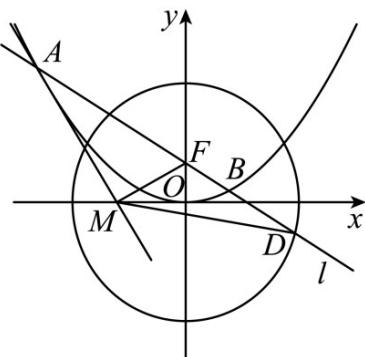

> [!faq]- 《专题24 圆锥曲线》真题解析
>
> > [!success]- **【答案】** 详见解析
>
> > [!note]- **【分析】**
> > 本题未单列分析。
>
> > [!note]- **【解析】**
> > 【答案】（1） $\frac{y^{2}}{9}+\frac{x^{2}}{8}=1$ ；（2）（i） $\pm\frac{\sqrt{6}}{4}$ ，（ii）详见解析.
> > 【详解】试题分析：（1）根据已知条件可求得 $C_2$ 的焦点坐标为 $(0,1)$ ，再利用公共弦长为 $2\sqrt{6}$ 即可求解；
> > (2) (i) 设直线 $l$ 的斜率为 $k$ ，则 $l$ 的方程为 $y = kx + 1$ ，由 $\left\{ \begin{array}{l} y = kx + 1 \\ x^2 = 4y \end{array} \right.$ 得 $x^2 + 16kx - 64 = 0$ ，根据条件可知 $\overline{AC} = \overline{BD}$ ，从而可以建立关于 $k$ 的方程，即可求解；(ii) 根据条件可说明 $FA$ 。
> > $\overrightarrow{FM}=\frac{x_{1}^{2}}{2}-y_{1}+1=\frac{x_{1}^{2}}{4}+1>0$ ，因此 $\angle AFM$ 是锐角，从而 $\angle MFD=180^{\circ}-\angle AFM$ 是钝角，即可得证
> > 试题
> > 【答案】（1） $\frac{y^{2}}{9}+\frac{x^{2}}{8}=1$ ；（2）（i） $\pm\frac{\sqrt{6}}{4}$ ，（ii）详见解析.
> > 【详解】试题分析：（1）根据已知条件可求得 $C_2$ 的焦点坐标为 $(0,1)$ ，再利用公共弦长为 $2\sqrt{6}$ 即可求解；
> > (2) (i) 设直线 $l$ 的斜率为 $k$ ，则 $l$ 的方程为 $y = kx + 1$ ，由 $\left\{ \begin{array}{l} y = kx + 1 \\ x^2 = 4y \end{array} \right.$ 得 $x^2 + 16kx - 64 = 0$ ，根据条件可知 $\overline{AC} = \overline{BD}$ ，从而可以建立关于 $k$ 的方程，即可求解；(ii) 根据条件可说明 $FA$ 。
> > $\overrightarrow{FM}=\frac{x_{1}^{2}}{2}-y_{1}+1=\frac{x_{1}^{2}}{4}+1>0$ ，因此 $\angle AFM$ 是锐角，从而 $\angle MFD=180^{\circ}-\angle AFM$ 是钝角，即可得证
> > 试题解析：（1）由 $C_1: x^2 = 4y$ 知其焦点 $F$ 的坐标为 $(0,1)$ ， $\because F$ 也是椭圆 $C_2$ 的一焦点，∴ $a^{2}-b^{2}=1$ ①，又 $C_{1}$ 与 $C_{2}$ 的公共弦的长为 $2\sqrt{6}$ ， $C_{1}$ 与 $C_{2}$ 都关于 y 轴对称，且 $C_{1}$ 的方程为 $x^{2}=4y$ ，由此易知 $C_{1}$ 与 $C_{2}$ 的公共点的坐标为 $(\pm\sqrt{6},\frac{3}{2})$ ，∴ $\frac{9}{4a^{2}}+\frac{6}{b^{2}}=1$ ②，联立①，②，得 $a^{2}=9$ ， $b^{2}=8$ ，故 $C_{2}$ 的方程为 $\frac{x^{2}}{9}+\frac{y^{2}}{8}=1$ ；（2）如图 f， $A(x_{1},y_{1})$ ， $B(x_{2},y_{2})$ ， $C(x_{3},y_{3})$ ， $D(x_{4},y_{4})$ ，
> > (i) $\because \overline{AC}$ 与 $\overline{BD}$ 同向，且 $|AC| = |BD|$ ， $\therefore \overline{AC} = \overline{BD}$ ，从而 $x_{3} - x_{1} = x_{4} - x_{2}$ ，即 $x_{1} - x_{2} = x_{3} - x_{4}$ ，于是 $(x_{1} + x_{2})^{2} - 4x_{1}x_{2} = (x_{3} + x_{4})^{2} - 4x_{3}x_{4}$ ③，设直线 $l$ 的斜率为 $k$ ，则 $l$ 的方程为 $y = kx + 1$ ，由 $\left\{ \begin{array}{l} y = kx + 1 \\ x^{2} = 4y \end{array} \right.$ 得 $y = kx + 1$ ，而 $x_{1}, x_{2}$ 是这个方程的两根， $\therefore x_{1} + x_{2} = 4k, x_{1}x_{2} = -4$ ④，由 $\frac{x^2}{8} + \frac{y^2}{9} = 1$ 得 $(9 + 8k^2)x^2 + 16kx - 64 = 0$ ，而 $x_{3}, x_{4}$ 是这个方程的两根， $\therefore x_{3} + x_{4} = -\frac{16k}{9 + 8k^2}, x_{3}x_{4} = -\frac{64}{9 + 8k^2}$ ⑤，将④⑤带入③，得 $16(k^2 + 1) = \frac{16^2k^2}{(9 + 8k^2)^2} + \frac{4 \times 64}{9 + 8k^2}$ ，即 $16(k^2 + 1) = \frac{16^2 \times 9(k^2 + 1)}{(9 + 8k^2)^2}$ ， $\therefore (9 + 8k^2)^2 = 16 \times 9$ ，解得 $k = \pm \frac{\sqrt{6}}{4}$ ，即直线 $l$ 的斜率为 $\pm \frac{\sqrt{6}}{4}$ .
> > 
> > 图f
> > (ii) 由 $x^{2} = 4y$ 得 $y' = \frac{x}{2}$ ， $\therefore C_{1}$ 在点 $\mathcal{A}$ 处的切线方程为 $y - y_{1} = \frac{x_{1}}{2}(x - x_{1})$ ，即
> > $y=x_{1}x-\frac{x_{1}^{2}}{4}$ ，令y=0，得 $x=\frac{x_{1}}{2}$ ，即 $M(\frac{x_{1}}{2},0)$ ， $\therefore\overrightarrow{FM}=(\frac{x_{1}}{2},-1)$ ，而 $FA=(x_{1},y_{1}-1)$ ，于是 $FA\cdot\overrightarrow{FM}=\frac{x_{1}^{2}}{2}-y_{1}+1=\frac{x_{1}^{2}}{4}+1>0$ ，因此 $\angle AFM$ 是锐角，从而 $\angle MFD=180^{\circ}-\angle AFM$ 是钝角·，故直线绕点
> > F 旋转时， $\Delta MFD$ 总是钝角三角形·
> > 考点： $^{1}$ ·椭圆的标准方程及其性质； $^{2}$ ·直线与椭圆位置关系·
> > 【名师点睛】本题主要考查了椭圆的标准方程及其性质以及直线与椭圆的位置关系，属于较难题，解决此类问题的关键：（1）结合椭圆的几何性质，如焦点坐标，对称轴， $a^{2}=b^{2}+c^{2}$ 等；（2）当看到题目中出现
> > 直线与圆锥曲线时，不需要特殊技巧，只要联立直线与圆锥曲线的方程，借助根与系数关系，找准题设条件中突显的或隐含的等量关系，把这种关系“翻译”出来，有时不一定要把结果及时求出来，可能需要整体代换到后面的计算中去，从而减少计算量·
