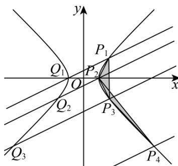

> [!faq]- 《专题24 圆锥曲线》真题解析
>
> > [!success]- **【答案】** 详见解析
>
> > [!note]- **【分析】**
> > 【分析】（1）直接根据题目中的构造方式计算出 $P_{2}$ 的坐标即可；
> >
> > (2) 根据等比数列的定义即可验证结论；
> >
> > (3) 思路一：使用平面向量数量积和等比数列工具，证明 $S_{n}$ 的取值为与 $n$ 无关的定值即可·思路二：使用等差数列工具，证明 $S_{n}$ 的取值为与 $n$ 无关的定值即可·
>
> > [!note]- **【解析】**
> > 【详解】（1）
> > 
> > 由已知有 $m = 5^{2} - 4^{2} = 9$ ，故 C 的方程为 $x^{2} - y^{2} = 9$ 。
> > 当 $k = \frac{1}{2}$ 时，过 $P_{1}(5,4)$ 且斜率为 $\frac{1}{2}$ 的直线为 $y = \frac{x + 3}{2}$ ，与 $x^{2} - y^{2} = 9$ 联立得到 $x^{2} - \left(\frac{x + 3}{2}\right)^{2} = 9$ 解得 $x = -3$ 或 $x = 5$ ，所以该直线与 $C$ 的不同于 $P_{1}$ 的交点为 $Q_{1}(-3,0)$ ，该点显然在 $C$ 的左支上。故 $P_{2}(3,0)$ ，从而 $x_{2} = 3$ ， $y_{2} = 0$ 。
> > (2) 由于过 $P_{n}(x_{n}, y_{n})$ 且斜率为 $k$ 的直线为 $y = k(x - x_{n}) + y_{n}$ ，与 $x^{2} - y^{2} = 9$ 联立，得到方程 $x^{2} - (k(x - x_{n}) + y_{n})^{2} = 9$ .
> > 展开即得 $\left(1 - k^2\right)x^2 - 2k(y_n - kx_n)x - \left(y_n - kx_n\right)^2 - 9 = 0$ ，由于 $P_n(x_n, y_n)$ 已经是直线 $y = k(x - x_n) + y_n$ 和 $x^2 - y^2 = 9$ 的公共点，故方程必有一根 $x = x_n$ 。
> > 从而根据韦达定理，另一根 $x = \frac{2k(y_n - kx_n)}{1 - k^2} - x_n = \frac{2ky_n - x_n - k^2x_n}{1 - k^2}$ ，相应的
> > $$
> > y = k \left(x - x _ {n}\right) + y _ {n} = \frac {y _ {n} + k ^ {2} y _ {n} - 2 k x _ {n}}{1 - k ^ {2}}
> > $$
> > 所以该直线与 $C$ 的不同于 $P_{n}$ 的交点为 $Q_{n}\left(\frac{2ky_{n} - x_{n} - k^{2}x_{n}}{1 - k^{2}},\frac{y_{n} + k^{2}y_{n} - 2kx_{n}}{1 - k^{2}}\right)$ ，而注意到 $Q_{n}$ 的横坐标亦可通过韦达定理表示为 $\frac{-(y_n - kx_n)^2 - 9}{(1 - k^2)x_n}$ ，故 $Q_{n}$ 一定在 $C$ 的左支上·
> > 所以 $P_{n + 1}\left(\frac{x_n + k^2x_n - 2ky_n}{1 - k^2},\frac{y_n + k^2y_n - 2kx_n}{1 - k^2}\right).$
> > 这就得到 $x_{n + 1} = \frac{x_n + k^2x_n - 2ky_n}{1 - k^2}$ ， $y_{n + 1} = \frac{y_n + k^2y_n - 2kx_n}{1 - k^2}$
> > 所以 $x_{n + 1} - y_{n + 1} = \frac{x_n + k^2x_n - 2ky_n}{1 - k^2} -\frac{y_n + k^2y_n - 2kx_n}{1 - k^2}$
> > $$
> > = \frac {x _ {n} + k ^ {2} x _ {n} + 2 k x _ {n}}{1 - k ^ {2}} - \frac {y _ {n} + k ^ {2} y _ {n} + 2 k y _ {n}}{1 - k ^ {2}} = \frac {1 + k ^ {2} + 2 k}{1 - k ^ {2}} \left(x _ {n} - y _ {n}\right) = \frac {1 + k}{1 - k} \left(x _ {n} - y _ {n}\right).
> > $$
> > 再由 $x_{1}^{2} - y_{1}^{2} = 9$ ，就知道 $x_{1} - y_{1}\neq 0$ ，所以数列 $\{x_n - y_n\}$ 是公比为 $\frac{1 + k}{1 - k}$ 的等比数列
> > (3) 方法一：先证明一个结论：对平面上三个点 $U, V, W$ ，若 $\overline{UV} = (a, b)$ ， $\overline{UW} = (c, d)$ ，则 $S_{\triangle UVW} = \frac{1}{2}|ad - bc|\cdot$ （若 $U, V, W$ 在同一条直线上，约定 $S_{\triangle UVW} = 0$ ）
> > 证明： $S_{\triangle UVW}=\frac{1}{2}\left|\overline{UV}\right|\cdot\left|\overline{UW}\right|\sin\overline{UV},\overline{UW}=\frac{1}{2}\left|\overline{UV}\right|\cdot\left|\overline{UW}\right|\sqrt{1-\cos^{2}\overline{UV},\overline{UW}}$
> > $$
> > = \frac {1}{2} \left| \overrightarrow {U V} \right| \cdot \left| \overrightarrow {U W} \right| \sqrt {1 - \left(\frac {\overrightarrow {U V} \cdot \overrightarrow {U W}}{\left| U V \right| \cdot \left| U W \right|}\right) ^ {2}} = \frac {1}{2} \sqrt {\left| \overrightarrow {U V} \right| ^ {2} \cdot \left| \overrightarrow {U W} \right| ^ {2} - \left(\overrightarrow {U V} \cdot \overrightarrow {U W}\right) ^ {2}}
> > $$
> > $$
> > \begin{array}{l} = \frac {1}{2} \sqrt {\left(a ^ {2} + b ^ {2}\right) \left(c ^ {2} + d ^ {2}\right) - \left(a c + b d\right) ^ {2}} \\ = \frac {1}{2} \sqrt {a ^ {2} c ^ {2} + a ^ {2} d ^ {2} + b ^ {2} c ^ {2} + b ^ {2} d ^ {2} - a ^ {2} c ^ {2} - b ^ {2} d ^ {2} - 2 a b c d} \\ = \frac {1}{2} \sqrt {a ^ {2} d ^ {2} + b ^ {2} c ^ {2} - 2 a b c d} = \frac {1}{2} \sqrt {\left(a d - b c\right) ^ {2}} = \frac {1}{2} | a d - b c |. \end{array}
> > $$
> > 证毕，回到原题·
> > 由于上一小问已经得到 $x_{n + 1} = \frac{x_n + k^2x_n - 2ky_n}{1 - k^2}$ ， $y_{n + 1} = \frac{y_n + k^2y_n - 2kx_n}{1 - k^2}$
> > $$
> > \text {衣} x _ {n + 1} + y _ {n + 1} = \frac {x _ {n} + k ^ {2} x _ {n} - 2 k y _ {n}}{1 - k ^ {2}} + \frac {y _ {n} + k ^ {2} y _ {n} - 2 k x _ {n}}{1 - k ^ {2}} = \frac {1 + k ^ {2} - 2 k}{1 - k ^ {2}} \left(x _ {n} + y _ {n}\right) = \frac {1 - k}{1 + k} \left(x _ {n} + y _ {n}\right).
> > $$
> > 再由 $x_{1}^{2} - y_{1}^{2} = 9$ ，就知道 $x_{1} + y_{1}\neq 0$ ，所以数列 $\{x_n + y_n\}$ 是公比为 $\frac{1 - k}{1 + k}$ 的等比数列
> > 所以对任意的正整数 $m$ ，都有
> > $$
> > \begin{array}{r l} & {x _ {n} y _ {n + m} - y _ {n} x _ {n + m}} \\ & {= \frac {1}{2} \Big (\big (x _ {n} x _ {n + m} - y _ {n} y _ {n + m} \big) + \big (x _ {n} y _ {n + m} - y _ {n} x _ {n + m} \big) \Big) - \frac {1}{2} \Big (\big (x _ {n} x _ {n + m} - y _ {n} y _ {n + m} \big) - \big (x _ {n} y _ {n + m} - y _ {n} x _ {n + m} \big) \Big)} \\ & {= \frac {1}{2} \big (x _ {n} - y _ {n} \big) \big (x _ {n + m} + y _ {n + m} \big) - \frac {1}{2} \big (x _ {n} + y _ {n} \big) \big (x _ {n + m} - y _ {n + m} \big)} \\ & {= \frac {1}{2} \Bigg (\frac {1 - k}{1 + k} \Bigg) ^ {m} \big (x _ {n} - y _ {n} \big) \big (x _ {n} + y _ {n} \big) - \frac {1}{2} \Bigg (\frac {1 + k}{1 - k} \Bigg) ^ {m} \big (x _ {n} + y _ {n} \big) \big (x _ {n} - y _ {n} \big)} \\ & {= \frac {1}{2} \Bigg (\Bigg (\frac {1 - k}{1 + k} \Bigg) ^ {m} - \Bigg (\frac {1 + k}{1 - k} \Bigg) ^ {m} \Bigg) \Big (x _ {n} ^ {2} - y _ {n} ^ {2} \Big)} \\ & {= \frac {9}{2} \Bigg (\Bigg (\frac {1 - k}{1 + k} \Bigg) ^ {m} - \Bigg (\frac {1 + k}{1 - k} \Bigg) ^ {m} \Bigg).} \\ & {\text {而又有} P _ {n + 1} P _ {n} = \left(- \big (x _ {n + 1} - x _ {n} \big), - \big (y _ {n + 1} - y _ {n} \big)\right), P _ {n + 1} P _ {n + 2} = \big (x _ {n + 2} - x _ {n + 1}, y _ {n + 2} - y _ {n + 1} \big),} \end{array}
> > $$
> > 故利用前面已经证明的结论即得
> > $$
> > \begin{array}{l} S _ {n} = S _ {\triangle P _ {n} P _ {n + 1} P _ {n + 2}} = \frac {1}{2} \left| - (x _ {n + 1} - x _ {n}) (y _ {n + 2} - y _ {n + 1}) + (y _ {n + 1} - y _ {n}) (x _ {n + 2} - x _ {n + 1}) \right| \\ = \frac {1}{2} \left| (x _ {n + 1} - x _ {n}) (y _ {n + 2} - y _ {n + 1}) - (y _ {n + 1} - y _ {n}) (x _ {n + 2} - x _ {n + 1}) \right| \\ = \frac {1}{2} \left| (x _ {n + 1} y _ {n + 2} - y _ {n + 1} x _ {n + 2}) + (x _ {n} y _ {n + 1} - y _ {n} x _ {n + 1}) - (x _ {n} y _ {n + 2} - y _ {n} x _ {n + 2}) \right| \end{array}
> > $$
> > $$
> > = \frac {1}{2} \left| \frac {9}{2} \left(\frac {1 - k}{1 + k} - \frac {1 + k}{1 - k}\right) + \frac {9}{2} \left(\frac {1 - k}{1 + k} - \frac {1 + k}{1 - k}\right) - \frac {9}{2} \left(\left(\frac {1 - k}{1 + k}\right) ^ {2} - \left(\frac {1 + k}{1 - k}\right) ^ {2}\right) \right|.
> > $$
> > 这就表明 $S_{n}$ 的取值是与 $n$ 无关的定值，所以 $S_{n} = S_{n + 1}$
> > 方法二：由于上一小问已经得到 $x_{n + 1} = \frac{x_n + k^2x_n - 2ky_n}{1 - k^2}$ ， $y_{n + 1} = \frac{y_n + k^2y_n - 2kx_n}{1 - k^2}$
> > $$
> > x _ {n + 1} + y _ {n + 1} = \frac {x _ {n} + k ^ {2} x _ {n} - 2 k y _ {n}}{1 - k ^ {2}} + \frac {y _ {n} + k ^ {2} y _ {n} - 2 k x _ {n}}{1 - k ^ {2}} = \frac {1 + k ^ {2} - 2 k}{1 - k ^ {2}} \left(x _ {n} + y _ {n}\right) = \frac {1 - k}{1 + k} \left(x _ {n} + y _ {n}\right).
> > $$
> > 再由 $x_{1}^{2} - y_{1}^{2} = 9$ ，就知道 $x_{1} + y_{1}\neq 0$ ，所以数列 $\left\{x_n + y_n\right\}$ 是公比为 $\frac{1 - k}{1 + k}$ 的等比数列
> > 所以对任意的正整数 $m$ ，都有
> > $$
> > \begin{array}{l} x _ {n} y _ {n + m} - y _ {n} x _ {n + m} \\ = \frac {1}{2} \left(\left(x _ {n} x _ {n + m} - y _ {n} y _ {n + m}\right) + \left(x _ {n} y _ {n + m} - y _ {n} x _ {n + m}\right)\right) - \frac {1}{2} \left(\left(x _ {n} x _ {n + m} - y _ {n} y _ {n + m}\right) - \left(x _ {n} y _ {n + m} - y _ {n} x _ {n + m}\right)\right) \\ = \frac {1}{2} \left(x _ {n} - y _ {n}\right) \left(x _ {n + m} + y _ {n + m}\right) - \frac {1}{2} \left(x _ {n} + y _ {n}\right) \left(x _ {n + m} - y _ {n + m}\right) \\ = \frac {1}{2} \left(\frac {1 - k}{1 + k}\right) ^ {m} \left(x _ {n} - y _ {n}\right) \left(x _ {n} + y _ {n}\right) - \frac {1}{2} \left(\frac {1 + k}{1 - k}\right) ^ {m} \left(x _ {n} + y _ {n}\right) \left(x _ {n} - y _ {n}\right) \\ = \frac {1}{2} \left(\left(\frac {1 - k}{1 + k}\right) ^ {m} - \left(\frac {1 + k}{1 - k}\right) ^ {m}\right) \left(x _ {n} ^ {2} - y _ {n} ^ {2}\right) \\ = \frac {9}{2} \left(\left(\frac {1 - k}{1 + k}\right) ^ {m} - \left(\frac {1 + k}{1 - k}\right) ^ {m}\right). \end{array}
> > $$
> > 这就得到 $x_{n + 2}y_{n + 3} - y_{n + 2}x_{n + 3} = \frac{9}{2}\left(\frac{1 - k}{1 + k} -\frac{1 + k}{1 - k}\right) = x_ny_{n + 1} - y_nx_{n + 1}$
> > $$
> > \text {以及} x _ {n + 1} y _ {n + 3} - y _ {n + 1} x _ {n + 3} = \frac {9}{2} \left(\left(\frac {1 - k}{1 + k}\right) ^ {2} - \left(\frac {1 + k}{1 - k}\right) ^ {2}\right) = x _ {n} y _ {n + 2} - y _ {n} x _ {n + 2}.
> > $$
> > 两式相减，即得 $\left(x_{n + 2}y_{n + 3} - y_{n + 2}x_{n + 3}\right) - \left(x_{n + 1}y_{n + 3} - y_{n + 1}x_{n + 3}\right) = \left(x_ny_{n + 1} - y_nx_{n + 1}\right) - \left(x_ny_{n + 2} - y_nx_{n + 2}\right).$
> > 移项得到 $x_{n + 2}y_{n + 3} - y_n x_{n + 2} - x_{n + 1}y_{n + 3} + y_n x_{n + 1} = y_{n + 2}x_{n + 3} - x_n y_{n + 2} - y_{n + 1}x_{n + 3} + x_n y_{n + 1}$
> > 故 $\left(y_{n+3}-y_{n}\right)\left(x_{n+2}-x_{n+1}\right)=\left(y_{n+2}-y_{n+1}\right)\left(x_{n+3}-x_{n}\right)$ .
> > $$
> > \text {而} P _ {n} P _ {n + 3} = \left(x _ {n + 3} - x _ {n}, y _ {n + 3} - y _ {n}\right), P _ {n + 1} P _ {n + 2} = \left(x _ {n + 2} - x _ {n + 1}, y _ {n + 2} - y _ {n + 1}\right).
> > $$
> > 所以 $P_{n}P_{n+3}$ 和 $P_{n+1}P_{n+2}$ 平行，这就得到 $S_{\triangle P_{n}P_{n+1}P_{n+2}} = S_{\triangle P_{n+1}P_{n+2}P_{n+3}}$ ，即 $S_{n} = S_{n+1}$ .
> > 【点睛】关键点点睛：本题的关键在于将解析几何和数列知识的结合，需要综合运用多方面知识方可得解2．（2018·全国·高考真题）已知斜率为 $k$ 的直线 $l$ 与椭圆 $C: \frac{x^2}{4} + \frac{y^2}{3} = 1$ 交于 $A$ ， $B$ 两点，线段 $AB$ 的中点为 $M(1, m) (m > 0)$ 。
> > (1) 证明： $k < -\frac{1}{2}$ ;
> > (2) 设 $F$ 为 $C$ 的右焦点， $P$ 为 $C$ 上一点，且 $\overline{FP} + \overline{FA} + \overline{FB} = 0$ 。证明： $\left| \overline{FA} \right|$ ， $\left| \overline{FP} \right|$ ， $\left| \overline{FB} \right|$ 成等差数列，并求该数列的公差。
> > 【答案】（1） $k < -\frac{1}{2}$ ；（2）证明见解析，公差为 $\frac{3\sqrt{21}}{28}$ 或 $-\frac{3\sqrt{21}}{28}$
> > 【分析】（ $^{1}$ ）方法一：设而不求，利用点差法进行证明。
> > (2) 方法一：解出 $m$ ，进而求出点 $P$ 的坐标，得到 $\left| \overline{FP} \right|$ ，再由两点间距离公式表示出 $\left| \overline{FA} \right|$ ， $\left| \overline{FB} \right|$ ，得到直线的方程，联立直线与椭圆方程由韦达定理进行求解。
> > 【详解】（1）[方法一]：【最优解】点差法
> > 设 $A\left(x_{1},y_{1}\right),B\left(x_{2},y_{2}\right)$ ，则 $\frac{x_1^2}{4} +\frac{y_1^2}{3} = 1,\frac{x_2^2}{4} +\frac{y_2^2}{3} = 1.$
> > 两式相减，并由 $\frac{y_1 - y_2}{x_1 - x_2} = k$ 得 $\frac{x_1 + x_2}{4} +\frac{y_1 + y_2}{3}\cdot k = 0$
> > 由题设知 $\frac{x_1 + x_2}{2} = 1, \frac{y_1 + y_2}{2} = m$ ，于是 $k = -\frac{3}{4m}$ .①
> > 由题设得 $0 < m < \frac{3}{2}$ ，故 $k < -\frac{1}{2}$ .
> > [方法二]：【通性通法】常规设线
> > 设 $AB:y = kx + t$ ， $A\left(x_{1},y_{1}\right),B\left(x_{2},y_{2}\right)$ ，当 $k = 0$ 时，显然不满足题意；
> > 由 $\left\{\begin{aligned}\frac{x^{2}}{4}+\frac{y^{2}}{3}=1\\ y=kx+t\end{aligned}\right.$ 得， $\left(3+4k^{2}\right)x^{2}+8ktx+4t^{2}-12=0$ ，所以， $x_{1}+x_{2}=-\frac{8kt}{3+4k^{2}}$
> > $\Delta>0$ ，即 $4k^{2}+3-t^{2}>0$ ，而 $\frac{x_{1}+x_{2}}{2}=1$ ，所以 $3+4k^{2}=-4kt$ ，
> > 又 $m = k + t = k - \frac{4k^{2} + 3}{4k} = \frac{-3}{4k} > 0$ ，所以 k < 0，
> > $4k^{2}+3-\left(\frac{4k^{2}+3}{-4k}\right)^{2}>0$ ，即 $k^{2}>\frac{1}{4}$ ，解得： $k<-\frac{1}{2}$
> > ## [方法三]：直线与椭圆系的应用
> > 对原椭圆作关于 $M(1,m)$ 对称的椭圆为 $\frac{(2 - x)^2}{4} +\frac{(2m - y)^2}{3} = 1$
> > 两椭圆方程相减可得 $x + \frac{4m}{3} y = 1 + \frac{4}{3} m^2$ ，即为 $AB$ 的方程，故 $k = -\frac{3}{4m}$
> > 又点 $M(1,m)$ 在椭圆 $C$ 内部可得 $\frac{1}{4} +\frac{m^2}{3} < 1$ ，解得： $0 <   m <   \frac{3}{2}$
> > 所以 $k = -\frac{3}{4m} < -\frac{1}{2}$
> > ## [方法四]：直线参数方程的应用
> > 设 $l$ 的参数方程为 $\left\{ \begin{array}{l} x = 1 + t\cos \theta, \\ y = m + t\sin \theta \end{array} \right.$ （为 $l$ 倾斜角， $t$ 为参数）代入椭圆 $C$ 中得
> > $\left(3\cos^2\theta +4\sin^2\theta\right)t^2 +(6\cos \theta +8m\sin \theta)t - 9 + 4m^2 = 0$ 设 $t_1,t_2$ 是线段中点 $A$ ， $B$ 对应的参数， $M(1,m)$ 是线
> > 段 $AB$ 中点，知 $t_1 + t_2 = 0$ 得 $-(6\cos \theta + 8m\sin \theta) = 0$ ，即 $k = \tan \theta = -\frac{3}{4m}$ 而点 $M(1, m)$ 在 $C$ 内得 $\frac{1}{4} + \frac{m^2}{3} < 1$
> > 解得： $m\in \left(0,\frac{3}{2}\right)$ ，所以 $k = -\frac{3}{4m} < -\frac{1}{2}$
> > ## (2) [方法一]：【通性通法】常规运算 + 整体思想
> > 由题意得 $F(1,0)$ ，设 $P(x_{3},y_{3})$ ，则
> > $$
> > \left(x _ {3} - 1, y _ {3}\right) + \left(x _ {1} - 1, y _ {1}\right) + \left(x _ {2} - 1, y _ {2}\right) = (0, 0).
> > $$
> > 由（1）及题设得 $x_{3} = 3 - (x_{1} + x_{2}) = 1, y_{3} = -(y_{1} + y_{2}) = -2m < 0$
> > 又点 P 在 C 上，所以 $m=\frac{3}{4}$ ，从而 $P\left(1,-\frac{3}{2}\right)$ ， $\left|FP\right|=\frac{3}{2}$ .
> > 于是 $\left|FA\right|=\sqrt{\left(x_{1}-1\right)^{2}+y_{1}^{2}}=\sqrt{\left(x_{1}-1\right)^{2}+3\left(1-\frac{x_{1}^{2}}{4}\right)}=2-\frac{x_{1}}{2}.$
> > 同理 $\left|\overline{FB}\right| = 2 - \frac{x_2}{2}$ 所以 $\left|\overline{FA}\right| + \left|\overline{FB}\right| = 4 - \frac{1}{2}\left(x_1 + x_2\right) = 3.$
> > 故 $2\left|\overline{FP}\right| = \left|\overline{FA}\right| + \left|\overline{FB}\right|$ ，即 $\left|\overline{FA}\right|$ ， $\left|\overline{FP}\right|$ ， $\left|\overline{FB}\right|$ 成等差数列·
> > 设该数列的公差为 $d$ ，则
> > $$
> > 2 | d | = \left\| F B \right| - \left| F A \right| = \frac {1}{2} \left| x _ {1} - x _ {2} \right| = \frac {1}{2} \sqrt {\left(x _ {1} + x _ {2}\right) ^ {2} - 4 x _ {1} x _ {2}}. \tag {②}
> > $$
> > 将 $m = \frac{3}{4}$ 代入①得 $k = -1$
> > 所以 $l$ 的方程为 $y = -x + \frac{7}{4}$ ，代入 $C$ 的方程，并整理得 $7x^{2} - 14x + \frac{1}{4} = 0$ .
> > 故 $x_{1} + x_{2} = 2, x_{1}x_{2} = \frac{1}{28}$ ，代入②解得 $\left|d\right| = \frac{3\sqrt{21}}{28}$ 。
> > 所以该数列的公差为 $\frac{3\sqrt{21}}{28}$ 或 $-\frac{3\sqrt{21}}{28}$ .
> > ## [方法二]：硬算
> > 由 $FP + FA + FB = 0$ ，知点 $F$ 为 $\triangle PAB$ 的重心，由三角形重心坐标公式可得 $x_{P} = 1, y_{P} = -2m$ ，即 $P(1, -2m)$ 由点 $P$ 在椭圆上，把坐标代入方程解得 $m = \frac{3}{4}$ ，即 $P(1, -\frac{3}{2})$ ：
> > 由（1）有 $k = -\frac{3}{4m} = -1$ ，直线 $l$ 的方程为 $y = -x + \frac{7}{4}$ ，将其与椭圆方程联立消去 $y$ 得 $28x^{2} - 56x + 1 = 0$ ，求得 $x_{1,2} = \frac{14 \pm 3\sqrt{21}}{14}$ ，不妨设 $x_{A} < x_{B}$ ，所以 $x_{A} = \frac{14 - 3\sqrt{21}}{14}$ ， $x_{B} = \frac{14 + 3\sqrt{21}}{14}$
> > $\left|FA\right|=\sqrt{\left(x_{A}-1\right)^{2}+y_{A}^{2}}=\sqrt{\left(x_{A}-1\right)^{2}+3\left(1-\frac{x_{A}^{2}}{4}\right)}=2-\frac{x_{A}}{2}=\frac{42+3\sqrt{21}}{28}$ ，同理可得，
> > $|FB|=2-\frac{x_{B}}{2}=\frac{42-3\sqrt{21}}{28}$ ，所以 $|FA|+|FB|=3$ ，而 $|FP|=\frac{3}{2}$ ，故 $\left|FA\right|+\left|FB\right|=2\left|FP\right|$
> > 即该数列的公差为 $\frac{3\sqrt{21}}{28}$ 或 $-\frac{3\sqrt{21}}{28}$ .
> > ## [方法三]：【最优解】焦半径公式的应用
> > 因为线段 AB 的中点为 $M(1,m)$ ，得 $x_{1} + x_{2} = 2$ 。
> > 由 $FP + FA + FB = 0$ ，知点 $F$ 为 $\triangle PAB$ 的重心，由三角形重心坐标公式可得 $x_{P} = 1$
> > 由椭圆方程可知， $e=\frac{1}{2}$
> > 由椭圆的焦半径公式得 $\left|FA\right|+\left|FB\right|=\left(a-\mathrm{e}x_{1}\right)+\left(a-\mathrm{e}x_{2}\right)=2a-\mathrm{e}\left(x_{1}+x_{2}\right)=3$ ， $\left|FP\right|=a-\mathrm{e}x_{P}=\frac{3}{2}$ ．所以 $\left|\stackrel{\square\square\square}{FA}\right|+\left|\stackrel{\square\square\square}{FB}\right|=2\left|\stackrel{\square\square\square}{FP}\right|$
> > 由方法二硬算可得， $x_{A}=\frac{14+3\sqrt{21}}{14}$ 或 $x_{A}=\frac{14-3\sqrt{21}}{14}$ ，从而公差为 $\frac{3}{2}-\left(2-\frac{1}{2}x_{A}\right)=\frac{1}{2}(x_{A}-1)$ ，即该数列的公差为 $\frac{3\sqrt{21}}{28}$ 或 $-\frac{3\sqrt{21}}{28}$ .
> > 【整体点评】（1）方法一：利用点差法找出斜率与中点坐标的关系，再根据中点在椭圆内得到不等关系，即可解出，对于中点问题，点差法是解决此类问题的常用解法，也是该题的最优解；
> > 方法二：常规设线，通过联立得出根与系数的关系（韦达定理），再根据 $\Delta > 0$ 即可证出，该法是解决直线与圆锥曲线位置关系的通性通法。
> > 方法三：；类比直线与圆系，采用直线与椭圆系的应用，可快速求出公共弦所在直线方程，从而得出斜率，进而得证，避免联立过程，适当简化运算；
> > 方法四：利用直线的参数方程以及参数的几何意义，联立求出斜率；
> > (2) 方法一：直接根据题意运算结合整体思想，是通性通法；
> > 方法二：直接硬算，思路直接，计算量较大；
> > 方法三：利用焦半径公式简化运算，是该题的最优解。
