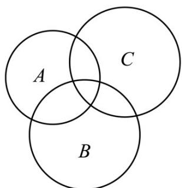

> [!faq]- 《专题25 新定义综合》真题解析
>
> > [!success]- **【答案】** A
>
> > [!note]- **【分析】**
> > 本题未单列分析。
>
> > [!note]- **【解析】**
> > 【答案】A
> > 【详解】命题①显然正确，通过如下文氏图亦可知 $d(A,C)$ 表示的区域不大于 $d(A,B)+d(B,C)$ 的区域，故命题②也正确，故选A.
> > 
> > 考点：集合的性质
