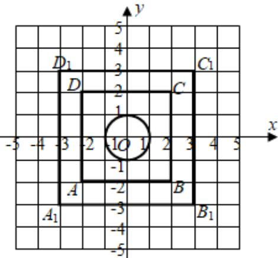

> [!faq]- 《专题25 新定义综合》真题解析
>
> > [!success]- **【答案】** C
>
> > [!note]- **【分析】**
> > 本题未单列分析。
>
> > [!note]- **【解析】**
> > 【答案】C
> > 【详解】因为集合 $A = \{(x,y) | x^2 + y^2 \leq 1, x, y \in Z\}$ ，所以集合 $A$ 中有 $5$ 个元素（即 $5$ 个点），即图中圆中的整点，集合 $B = \{(x,y)\| x|\leq 2,|y|\leq 2,x,y\in Z\}$ 中有25个元素（即25个点）：即图中正方形ABCD中的整点，集合 $A\oplus B = \{(x_{1} + x_{2},y_{1} + y_{2})|(x_{1},y_{1})\in A,(x_{2},y_{2})\in B\}$ 的元素可看作正方形 $A_{1}B_{1}C_{1}D_{1}$ 中的整点（除去四个顶点），即 $7\times 7 - 4 = 45$ 个.
> > 
> > 考点： $^{1}$ ．集合的相关知识， $^{2}$ ．新定义题型．
> > ## 二、大题
