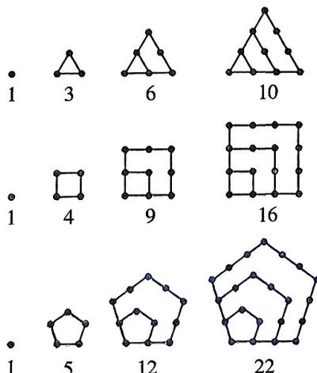

<!-- question-source:start -->
4.[湖北襄阳六中等六校2025高二期中]传说古希腊毕达哥拉斯学派的数学家用沙粒和小石子来研究数,他们根据沙粒或小石子所排列的形状把数分成许多类,如图中第一行的1,3,6,10称为三角形数,第二行的1,4,9,16称为正方形数,第三行的1,5,12,22称为五边形数.则正方形数、五边形数所构成的数列的第5项分别为()

A.24,34 B.25,35 C.25,34 D.24,35
<!-- question-source:end -->

![[Q00070017A1]]
