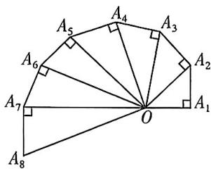

<!-- question-source:start -->
9.[安徽马鞍山二中2024高二阶段检测]第七届国际数学教育大会会徽的主体图案可以看成是由如图所示的一连串直角三角形演化而成的,其中 $OA_{1} = A_{1}A_{2} = A_{2}A_{3} = \dots = A_{7}A_{8} = 1$ ，若把图中的直角三角形继续作下去，记 $OA_{1}$ $OA_{2},\dots ,OA_{n}$ 的长度构成的数列为 $\{a_n\}$ ，则 $a_{100} =$ （

A. $\frac{1}{10}$ B. 1 C. 10 D. 100
<!-- question-source:end -->

![[Q00070052A1]]
