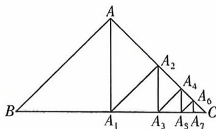

<!-- question-source:start -->
20. [河南信阳高中 2025 高二月考] 如图所示, 在等腰直角三角形 ABC 中, 斜边 $BC = \sqrt{2}$ , 过点 A 作 BC 边的垂线, 垂足为 $A_{1}$ , 过点 $A_{1}$ 作 AC 边的垂线, 垂足为 $A_{2}$ , 过点 $A_{2}$ 作 $A_{1}C$ 边的垂线, 垂足为 $A_{3}, \cdots$ , 以此类推. 设 $BA = a_{1}, AA_{1} = a_{2}, A_{1}A_{2} = a_{3}, \cdots, A_{6}A_{7} = a_{8}$ , 则 $a_{7} =$ ( )

A. $\frac{1}{4}$ B. $\frac{1}{8}$ C. $\frac{1}{16}$ D. $\frac{1}{32}$

## 刷|提升
<!-- question-source:end -->

![[Q00070139A1]]
