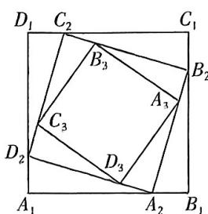

<!-- question-source:start -->
5.[江西宜春一中2025高二月考]如图,正方形 $A_{1}B_{1}C_{1}D_{1}$ 的边长为1,取正方形各边的四等分点 $A_{2},B_{2},C_{2},D_{2}$ ,得到第2个正方形 $A_{2}B_{2}C_{2}D_{2}$ ,再取正方形 $A_{2}B_{2}C_{2}D_{2}$ 各边的四等分点 $A_{3},B_{3},C_{3},D_{3}$ ,得到第3个正方形 $A_{3}B_{3}C_{3}D_{3}$ ,依此方法一直进行下去,若从第k个正方形开始它的面积小于第1个正方形面积的 $\frac{1}{50}$ ,则k=() (参考数据: $\lg 2\approx0.3$ )

A. 8 B. 9 C. 10 D. 11

答案P101
<!-- question-source:end -->

![[Q00070144A1]]
