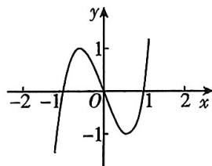
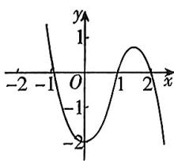
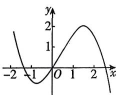
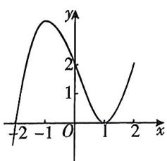
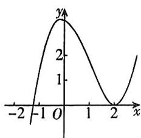

<!-- question-source:start -->
4. 教材变式 [陕西西安高新一中 2025 高二开学考] 已知函数 $y = xf'(x)$ 的图象如图所示 (其中 $f'(x)$ 是函数 $f(x)$ )

的导函数), 则 $y = f(x)$ 的图象可能是 ( )

A

B

C

D

√ 答案 P127
<!-- question-source:end -->

![[Q00070383A1]]
