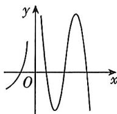
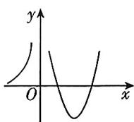
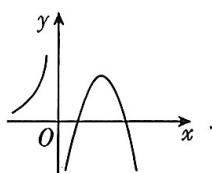
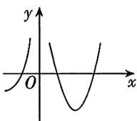
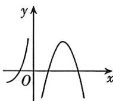

<!-- question-source:start -->
16. (多选) [河北保定 2025 高二月考] 设函数 $f(x)$ 在定义域内可导, $y = f(x)$ 的图象如图所示, 则导函数 $y = f'(x)$ 的图象不可能是 ( )

A

B

C

D

## 易错点2 利用导数研究函数单调性时考虑不全致误
<!-- question-source:end -->

![[Q00070395A1]]
