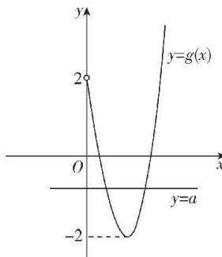

> [!faq]- 答案与解析
>
> > [!success]- **【答案】** $(-2,2)$
>
> > [!note]- **【解析】**
> > 由 $x^{3}-3x=a-2(x-1)^{2}$ ，即 $a=x^{3}+2x^{2}-7x+2$ 。
> > 令 $g(x)=x^{3}+2x^{2}-7x+2$ ，则 $g'(x)=3x^{2}+4x-7=(3x+7)(x-1)$ ，所以当 $x\in(0,1)$ 时， $g'(x)<0$ ， $g(x)$ 单调递减，
> > 当 $x\in(1,+\infty)$ 时， $g'(x)>0$ ， $g(x)$ 单调递增，且 $g(0)=2$ ， $g(1)=-2$ ，作出 $g(x)$ 在 $(0,+\infty)$ 上的大致图象如图所示。
> > 方程 $x^{3}-3x=a-2(x-1)^{2}$ 在 $(0,+\infty)$ 上有两个不同的实数解，
> > 等价于直线 y=a 与曲线 $y=g(x)$ 有两个交点，所以 $a\in(-2,2)$ .
> >
> > 
