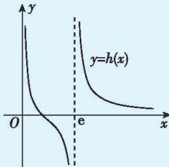

> [!faq]- 答案与解析
>
> > [!success]- **【答案】** 详见解析
>
> > [!note]- **【解析】**
> > 【解】(1)由函数 $f(x)=(kx+1)\ln x-kx$ 在 $(0,+\infty)$ 上单调递增，可得 $f'(x)=k\ln x+\frac{1}{x}\geqslant0$ 对 $x\in(0,+\infty)$ 恒成立，当x=1时，显然成立；当 $x\in(0,1)$ 时， $k\leqslant\frac{-1}{x\ln x}$ ；当 $x\in(1,+\infty)$ 时， $k\geqslant\frac{-1}{x\ln x}$ 。令 $g(x)=x\ln x,x>0$ 且 $x\neq1$ ，则 $g'(x)=\ln x+1$ ，当 $x\in\left(0,\frac{1}{e}\right)$ 时， $g'(x)<0$ ；当 $x\in\left(\frac{1}{e},1\right)$ 时， $g'(x)>0$ ；当 $x\in(1,+\infty)$ 时， $g'(x)>0$ ，所以 $g(x)$ 在 $\left(0,\frac{1}{e}\right)$ 上单调递减，在 $\left(\frac{1}{e},1\right)$ 上单调递增，在 $(1,+\infty)$ 上单调递增，当 $x=\frac{1}{e}$ 时，可得 $g\left(\frac{1}{e}\right)=\frac{1}{e}\ln\frac{1}{e}=-\frac{1}{e}$ ，当x>1时， $g(x)>0$ ，所以当 $x\in(0,1)$ 时， $g(x)\in\left(-\frac{1}{e},0\right),\frac{-1}{g(x)}\in(e,+\infty)$ ，则 $k\leqslant e$ ；当 $x\in(1,+\infty)$ 时， $g(x)\in(0,+\infty)$ ， $\frac{-1}{g(x)}\in(-\infty,0)$ ，则 $k\geqslant0$ 。综上，实数k的取值范围是[0,e]。(2)由(1)可知，当k=0时， $f(x)=\ln x$ 有一个零点；当 $0<k\leqslant e$ 时， $f(x)$ 在 $(0,+\infty)$ 上单调递增，当x趋于0时， $f(x)$ 趋于负无穷大，且 $f(e)=1$ ，故 $f(x)$ 只有一个零点。当k>e时， $f'(x)=k\ln x+\frac{1}{x}$ 。令 $h(x)=k\ln x+\frac{1}{x}$ ，则 $h'(x)=\frac{k}{x}-\frac{1}{x^{2}}=\frac{kx-1}{x^{2}}$ ，当 $x\in\left(0,\frac{1}{k}\right)$ 时， $h'(x)<0$ ；当 $x\in\left(\frac{1}{k},+\infty\right)$ 时， $h'(x)>0$ ，可得 $f'(x)$ 在 $\left(0,\frac{1}{k}\right)$ 上单调递减，在 $\left(\frac{1}{k},+\infty\right)$ 上单调递增， $f'\left(\frac{1}{k}\right)=k\left(\ln\frac{1}{k}+1\right)=k(1-\ln k)<0.$ 当x趋于0时，因为 $x\ln x$ 趋于0，所以 $f'(x)=\frac{kx\ln x+1}{x}$ 趋于正无穷大，
> >
> > 又因为 $f'(1)=1>0$ ，所以存在 $0<x_{1}<\frac{1}{k}<x_{2}<1$ ，使得 $f'(x_{1})=f'(x_{2})=0$ ，
> > 所以 $f(x)$ 在 $(0,x_{1})$ 上单调递增，在 $(x_{1},x_{2})$ 上单调递减，在 $(x_{2},+\infty)$ 上单调递增，
> > 且当0<x<1时， $f(x)<0,f(e)=1$ ，所以当k>e时， $f(x)$ 只有一个零点。
> > 当k<0时， $f'(x)=k\ln x+\frac{1}{x}$ 在 $(0,+\infty)$ 上单调递减， $f'(1)=1>0$ ，
> > 且x趋于正无穷大时， $f'(x)<0$ ，所以存在 $x_{0}>1$ ，使得 $f'(x_{0})=0$ ，
> > 所以 $f(x)$ 在 $(0,x_{0})$ 上单调递增，在 $(x_{0},+\infty)$ 上单调递减，
> > 又当x趋于0时， $f(x)$ 趋于负无穷大， $f(e)=1$ 当 $k\leqslant-\frac{1}{2}$ 时， $f(e^{5})=5+4ke^{5}<0$ ，当 $-\frac{1}{2}<k<0$ 时， $f\left(\frac{-5}{k}\right)=-4\ln\frac{-5}{k}+5<0.$ 故当k<0时，无论k为何值，取 $x=\max\left\{-\frac{5}{k},e^{5}\right\}$ ，总能有 $f(x)<0$ ，
> > 所以当k<0时， $f(x)$ 有两个零点。
> > 综上所述，当k<0时， $f(x)$ 有两个零点；当 $k\geqslant0$ 时， $f(x)$ 有一个零点。
> > 多种解法 （2）由题意，可得 $f(e)=1$ ，故当 $x\in(0,e)\cup(e,+\infty)$ 时，令 $f(x)=0$ ，可得 $-k=\frac{\ln x}{x\ln x-x}$ .
> > 令 $h(x)=\frac{\ln x}{x\ln x-x}$ ，则 $h'(x)=\frac{\ln x-1-(\ln x)^{2}}{(x\ln x-x)^{2}}=\frac{-(\ln x-\frac{1}{2})^{2}-\frac{3}{4}}{(x\ln x-x)^{2}}<0,$ 所以 $h(x)=\frac{\ln x}{x\ln x-x}$ 在 $(0,e)$ 上单调递减，在 $(e,+\infty)$ 上也单调递减，且当x大于0且趋于0时， $h(x)$ 趋于正无穷大，当x小于e且趋于e时， $h(x)$ 趋于负无穷大，当x大于e且趋于e时， $h(x)$ 趋于正无穷大，当x趋于正无穷大时， $h(x)$ 趋于0，
> > 故h(x的大致图象如图所示，由图象可知，当k<0时， $f(x)$ 有两个零点；
> > 当 $k\geqslant0$ 时， $f(x)$ 有一个零点。
> >
> > 
> >
> > 归纳总结 利用导数研究函数的零点个数问题的求解策略
> > (1) 分离参数法: 将参数分离出来, 得到一端是参数, 另一端是变量的表达式, 转化为求解含有变量的表达式对应的函数的最值问题, 从而根据参数的范围与函数的值域判断零点的个数;
> >
> > (2)研究含参函数单调性法:利用导数研究含参函数的单调性,分析函数的极值与端点、特殊点处函数值的正负,从而得到函数在各个单调区间上的零点个数,从而得到函数的零点个数;
> > (3)图象法:对于由两个相对简单的函数加减得到的函数,可以将两个简单函数分离到等号两侧,各自作出图象,通过研究两个函数图象的公共点去研究原函数的零点个数.
