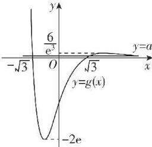

> [!faq]- 答案与解析
>
> > [!success]- **【答案】** A
>
> > [!note]- **【解析】**
> > A 【解析】函数 $f(x) = 2 - \frac{2}{\mathrm{e}^x + 1}$ 的定义域为 $\mathbf{R}$ , 且在 $\mathbf{R}$ 上单调递增, $f(x) + f(-x) = 2 - \frac{2}{\mathrm{e}^x + 1} + 2 - \frac{2}{\mathrm{e}^{-x} + 1} = 4 - \left(\frac{2}{\mathrm{e}^x + 1} + \frac{2\mathrm{e}^x}{1 + \mathrm{e}^x}\right) = 2$ , 即 $2 - f(-x) = f(x)$ , 方程 $f(a\mathrm{e}^x) + f(3 - x^2) = 2$ , 即 $f(a\mathrm{e}^x) = 2 - f(3 - x^2) = f(x^2 - 3)$ , 于是 $a\mathrm{e}^x = x^2 - 3$ , 即 $a = \frac{x^2 - 3}{\mathrm{e}^x}$ .
> >
> > 点悟: 求参的题目如果能分离参数,优先考虑参变分离
> > 令 $g(x)=\frac{x^{2}-3}{e^{x}}$ ,依题意,直线 $y=a$ 与函数 $y=g(x)$ 的图象有三个不同的交点,
> >
> > 黑板：将方程根的个数问题转化为两函数图象交点的个数问题求导得 $g^{\prime}(x) = \frac{2x - x^{2} + 3}{\mathrm{e}^{x}} =$ $\frac{(x + 1)(x - 3)}{\mathrm{e}^x}$ 当 $x\in (-\infty , - 1)\cup (3, + \infty)$ 时， $g^{\prime}(x) <   0,$ 当 $x\in (-1,3)$ 时， $g^{\prime}(x) > 0$ ，所以函数 $g(x)$ 在 $(- \infty , - 1),(3, + \infty)$ 上单调递减，在 $(-1,3)$ 上单调递增，当 $x = -1$ 时， $g(x)$ 取极小值 $g(-1) =$ $-2\mathrm{e};$ 当 $x = 3$ 时， $g(x)$ 取极大值 $g(3) =$ $\frac{6}{\mathrm{e}^3}$ ，而当 $x <   - \sqrt{3}$ 或 $x > \sqrt{3}$ 时，恒有 $g(x) > 0,$ 在同一坐标系内作出直线 $y = a$ 与函数 $y = g(x)$ 的大致图象如图所示，观察图象得，当 $0 <   a <   \frac{6}{\mathrm{e}^3}$ 时，直线 $y = a$ 与函数 $y = g(x)$ 的图象有三个交点，即原方程有三个不同实根，所以实数 $a$ 的取值范围为 $\left(0,\frac{6}{\mathrm{e}^3}\right)$ .故选A.
> >
> > 
