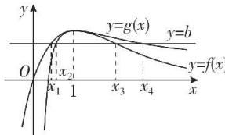
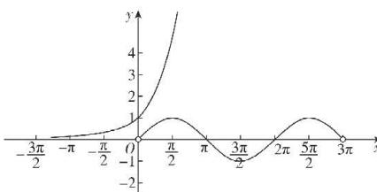

> [!faq]- 答案与解析
>
> > [!success]- **【答案】** B
>
> > [!note]- **【解析】**
> > B 【解析】作出曲线 $y=\sin x, x\in(0,3\pi)$ 和曲线 $y=e^{x}$ ，如图所示.
> >
> > $f'(x)=0$ , 得 x=1.
> > 当 x>1 时， $f'(x)<0$ ，此时 $f(x)$ 在 $(1,+\infty)$ 上单调递减，
> > 当 x<1 时， $f'(x)>0$ ，此时 $f(x)$ 在 $(-∞,1)$ 上单调递增，故 $f(x)_{极大值}=f(1)=1$ ，无极小值.
> > (2)【证明】 $f(x)-g(x)=\frac{x}{e^{x-1}}-\frac{1+\ln x}{x}=\frac{x}{e^{x-1}}-\frac{1+\ln x}{e^{1+\ln x-1}}=f(x)-f(1+\ln x).$
> >
> > 故黑板：整理变形成同构形式，利用函数的单调性解决问题
> > 令 $\varphi(x)=x-1-\ln x$ ,
> > 则 $\varphi'(x)=\frac{x-1}{x}<0$ 在 $(0,1)$ 上恒成立，故 $\varphi(x)$ 在 $(0,1)$ 上单调递减.
> > ∴ $\varphi(x) > \varphi(1) = 0$ ，即 $x > 1 + \ln x (0 < x < 1)$ .
> > 由(1)可知 $f(x)$ 在 $(-∞,1)$ 上单调递增， $1 > x > 1 + \ln x, \therefore f(x) > f(1 + \ln x)$ ，即 $f(x) > g(x) (0 < x < 1)$ .
> > (3)【证明】由(2)同理可证，当x>1时， $f(x)<g(x)$ .
> > 令 $F(x)=0$ ，得 $b=\frac{x}{e^{x-1}}=\frac{1+\ln x}{x}(x>0)$ 由题意得直线 y=b 与两条曲线 $y=f(x), y=g(x)$ 共有四个交点.
> > 如图所示，由图可知 $f(x_{1})=g(x_{2})=f(x_{3})=g(x_{4})=b$ ，且 $0<x_{1}<x_{2}<1<x_{3}<x_{4}$
> >
> > 
> >
> > 由 $g(x_{2}) = f(1 + \ln x_{2})$ ，得 $f(x_{1}) = f(1 + \ln x_{2}).\because x_{1} <   1,1 + \ln x_{2} <   1,$ 且 $f(x)$ 在 $(- \infty ,1)$ 上单调递增， $\therefore x_1 = 1 + \ln x_2$ ，即 $\mathrm{e}^{x_1 - 1} = x_2.\therefore \frac{x_1}{\mathrm{e}^{x_1 - 1}} =$ $\frac{x_1}{x_2} = b.$ 同理可得 $\frac{x_3}{x_4} = b.$ 故 $\frac{x_1}{x_2} = \frac{x_3}{x_4}$ ，即 $x_{1}x_{4} = x_{2}x_{3}$ ，得证.
> >
> > 
> >
> > 设直线 l 与曲线 $y=\sin x, x\in(0,3\pi)$ 的切点为 $A(x_{1},\sin x_{1})$ ，与曲线 $y=e^{x}$ 的切点为 $B(x_{2},e^{x_{2}})$ ，直线 l 的斜率为 k.
> > 所以 $y_{1}^{\prime}=(\sin x)^{\prime}=\cos x$ ，即曲线 $y=\sin x, x\in(0,3\pi)$ 在点 $A(x_{1},\sin x_{1})$ 处的切线斜率为 $k=\cos x_{1}$ ， $y_{2}^{\prime}=(e^{x})^{\prime}=e^{x}$ ，即曲线 $y=e^{x}$ 在点 $B(x_{2},e^{x_{2}})$ 处的切线斜率为 $k=e^{x_{2}}$ ，得 k=$\cos x_{1} = \mathrm{e}^{x_{2}}$ 又因为 $\cos x_{1}\in [-1,1],\mathrm{e}^{x_{2}}\in (0, + \infty)$ 所以斜率 $k = \cos x_{1} = \mathrm{e}^{x_{2}}\in (0,1]$ 由 $\cos x_1\in (0,1]$ ，得 $x_{1}\in \left(0,\frac{\pi}{2}\right)$ 或 $x_{1}\in \left(\frac{3\pi}{2},\frac{5\pi}{2}\right)$ ；由 $\mathrm{e}^{\mathrm{x}_2}\in (0,1]$ ，得 $x_{2}\in$ $(-\infty ,0)$ ，令 $\cos x_1 - \mathrm{e}^{x_2} = 0$ ，因为 $y = \cos x_{1}$ 在 $\left(0,\frac{\pi}{2}\right)$ 上单调递减， $y = -\mathrm{e}^{x_2}$ 在（-∞，0）上单调递减，所以方程 $\cos x_1 - \mathrm{e}^{x_2} =$ 0在 $x_{1}\in \left(0,\frac{\pi}{2}\right),x_{2}\in (-\infty ,0)$ 上有唯一解因此，存在唯一 $A(x_{1},\sin x_{1}),x_{1}\in$ $\left(0,\frac{\pi}{2}\right)$ 和 $B(x_{2},\mathrm{e}^{x_{2}}),x_{2}\in (-\infty ,0)$ 使得 $k = \cos x_1 = \mathrm{e}^{x_2}$ ，此时直线AB即为两条曲线的公切线同理，存在唯一 $C(x_{3},\sin x_{3}),x_{3}\in$ $\left[2\pi ,\frac{5\pi}{2}\right)$ 和 $D(x_4,\mathrm{e}^{x_4}),x_4\in (-\infty ,$ 0)，使得 $k = \cos x_3 = \mathrm{e}^{x_4}$ ，且 $\mathrm{e}^{x_4}\neq \mathrm{e}^{x_2}$ 所点悟：当 $x_{3}\in \left(\frac{3\pi}{2},2\pi\right)$ 时，曲线 $y = \sin x$ 在点 $C$ 处的切线显然不与曲线 $y=$ e相切以直线CD即为异于直线AB的第二条曲线的公切线.
