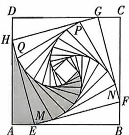

<!-- question-source:start -->
2. (多选)[陕西西安陕西师大附中 2025 高二月考]在边长为 3 的正方形 ABCD 中,作它的内接正方形 EFGH,且使得 $\angle BEF = 15^{\circ}$ ,再作正方形 EFGH 的内接正方形 MNPQ,使得 $\angle FMN = 15^{\circ}$ 依次进行下去,就形成了如图所示的图案. 设第 $n$ 个正方形的边长为 $a_{n}$ (其中第 1 个正方形的边长为 $a_{1} = AB$ ,第 2 个正方形的边长为 $a_{2} = EF\dots\cdots$ ),第 $n$ 个直角三角形(阴影部分)的面积为 $S_{n}$ (其中第 1 个直角三角形 AEH 的面积为 $S_{1}$ ,第 2 个直角三角形 EQM 的面积为 $S_{2}\cdots\cdots$ ),则()

A. $a_2 = \sqrt{6}$ B. $S_{1} = \frac{3}{4}$ C.数列 $\{S_n\}$ 是公比为 $\frac{\sqrt{6}}{3}$ 的等比数列
D.数列 $\{a_n^2\}$ 的前 $n$ 项和 $T_{n}$ 满足 $9\leqslant T_{n} <   27$
<!-- question-source:end -->

![[Q00070236A1]]
