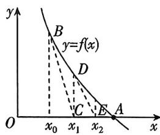

<!-- question-source:start -->
2.[广东佛山2025高二月考]已知函数 $f(x)=x\mathrm{e}^{x}-\frac{1}{2}x^{2}-x-1$ .

(1) 求 $f(x)$ 的极值；

(2) 证明: $f(x) \geqslant \ln x - \frac{1}{2} x^2$ .

## ③ 放缩(背景为切线放缩)

3. 17 世纪, 牛顿在《流数法与无穷级数》一书中, 给出了代数方程的一种数值解法: 如图所示, 我们想要找到 $f(x) = 0$ 的根, 即 $A$ 点的横坐标, 则可以先在 $A$ 点附近取一个初始值, 比如横坐标为 $x = x_0$ 处, 然后在以 $x_0$ 为横坐标的 $B$ 点处做一条切线, 并求出该切线与 $x$ 轴的交点的横坐标 $x_1$ , 此时, 我们会发现 $x_1$ 比初始值 $x_0$ 更接近 $A$ 点的横坐标. 如果重复这个过程, 不断绘制切线并计算其与 $x$ 轴的交点的横坐标, 依次迭代下去, 我们将得到 $x_2, x_3, x_4, \cdots, x_n, \cdots$ , 根据给定的精确度 $\xi$ , 直到求得满足精确度 $|x_{n+1} - x_n| < \xi$ 的近似解 $x_n$ 为止 ( $n \in \mathbb{N}$ ). 这就是牛顿迭代法 (切线法) 的原理. 已知 $f(x) = e^x - x^2$ , 取 $x_0 = 1$ .

(1)根据牛顿迭代法,求 $x_{1}$ .

(2) 求 $x_{n+1}$ 与 $x_n$ 的关系式 $(n \in \mathbf{N})$ .

(3)牛顿迭代法中蕴含了“以直代曲”的数学思想,直线常常取曲线的切线或割线.若 $g(x)=x\ln x-x^{2}+(e-1)x+1$ ,求证: $f(x)\geqslant g(x)$ .

## ④ 凹凸反转
<!-- question-source:end -->

![[Q00070478A1]]
