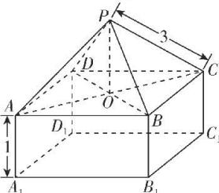

> [!faq]- 答案与解析
>
> > [!success]- **【答案】** D
>
> > [!note]- **【解析】**
> > D 【解析】如图所示, 连接 AC 与 BD 交于点 O, 连接 PO.
> > 因为四棱锥 P-ABCD 为正四棱锥, 所以 $PO \perp$ 平面 ABCD.
> > 又因为 $AO \subset$ 平面 ABCD, 所以 $PO \perp AO$ . 由题意知, 正四棱锥的侧棱长为 3, 且正四棱柱 $ABCD-A_{1}B_{1}C_{1}D_{1}$ 的侧棱长为 1, 设正四棱柱 $ABCD-A_{1}B_{1}C_{1}D_{1}$ 的底面边长为 2a,
> > 在正方形 ABCD 中, 可得 $AO = \sqrt{2} a$ , 所以 $PO = \sqrt{PA^{2} - AO^{2}} = \sqrt{9 - 2a^{2}}$ ,
> > 则该几何体的体积 $V(a)=4a^{2}\times1+\frac{1}{3}\times4a^{2}\times\sqrt{9-2a^{2}}$ . 令 $t=\sqrt{9-2a^{2}}$ ,
> > 可得 $a^{2}=\frac{9-t^{2}}{2}$ 且 0<t<3,
> > 可得 $V(t)=4\times\frac{9-t^{2}}{2}\times1+\frac{1}{3}\times4\times\frac{9-t^{2}}{2}\times t=-\frac{2}{3}t^{3}-2t^{2}+6t+18,$ 则 $V'(t)=-2t^{2}-4t+6=-2(t+3)(t-1)$ ，当 $t\in(0,1)$ 时， $V'(t)>0,V(t)$ 单调递增；当 $t\in(1,3)$ 时， $V'(t)<0,V(t)$ 单调递减.
> > 所以当 t=1 时，函数 $V(t)$ 取得最大值，最大值为 $V(1)=\frac{64}{3}$ ，所以该几何体体积的最大值为 $\frac{64}{3}$ . 故选 D.
> >
> > 
