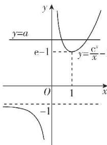

> [!faq]- 答案与解析
>
> > [!success]- **【答案】** ABD
>
> > [!note]- **【解析】**
> > ABD 【解析】当 a=0 时, $f(x)=\mathrm{e}^{x}-x$ , $f'(x)=\mathrm{e}^{x}-1$ , 令 $f'(x)>0$ , 得 x>0, 令 $f'(x)<0$ , 得 x<0,
> > 所以 $f(x)$ 在 $(-∞,0)$ 上单调递减，在 $(0,+∞)$ 上单调递增，所以 $f(x)\geqslant f(0)=1>0$ ，故 A 正确，B 正确；
> > 若 $\frac{f(x_{1})-f(x_{2})}{x_{1}-x_{2}}>0(x_{1}\neq x_{2})$ 恒成立，则 $f(x)$ 在 R 上是增函数，
> > 所以 $f'(x)=\mathrm{e}^{x}-a-1\geqslant0$ 在 R 上恒成立，即 $a\leqslant e^{x}-1$ 恒成立.
> > 又 $e^{x}-1>-1$ ，所以 $a\leqslant-1$ 所以“ $a<-1$ ”是“ $\frac{f(x_{1})-f(x_{2})}{x_{1}-x_{2}}>0(x_{1}\neq x_{2})$ 恒成立”的充分不必要条件，C 错误；
> > 由题易得 x=0 不是函数 $f(x)$ 的零点，
> > 令 $f(x)=0$ ，得 $a=\frac{e^{x}}{x}-1$ 令 $g(x)=\frac{e^{x}}{x}-1$ ，则 $g'(x)=\frac{\mathrm{e}^{x}(x-1)}{x^{2}}$ 令 $g'(x)>0$ ，得 x>1，令 $g'(x)<0$ ，得 x<1 且 $x\neq0$ 所以 $g(x)$ 在 $(-∞,0)$ ， $(0,1)$ 上单调递减，在 $(1,+∞)$ 上单调递增，
> >
> > $g(x)$ 的极小值是 $g(1)=\mathrm{e}-1,x\rightarrow0^{+}$ 时， $g(x)\rightarrow+\infty,x\rightarrow+\infty$ 时， $g(x)\rightarrow+\infty,x\rightarrow0^{-}$ 时， $g(x)\rightarrow-\infty,x\rightarrow-\infty$ 时， $g(x)\rightarrow-1^{-}$ ，则 $g(x)$ 的图象如图所示.
> >
> > 
> >
> > 由图可得, 若 y=a 与 $y=\frac{e^{x}}{x}-1$ 的图象有两个交点, 则 a>e-1, D 正确.
> >
> > 故选 **ABD**.
