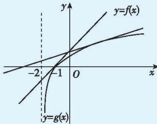

> [!faq]- 答案与解析
>
> > [!success]- **【答案】** B
>
> > [!note]- **【解析】**
> > B 【解析】由题意, $f(x)\geqslant g(x)\Leftrightarrow$ $f(x)-g(x)\geqslant0$ , 令 $t(x)=f(x)-g(x)=ax+b-\ln(x+2)(x\geqslant-2)$ ,
> > 则 $\forall x>-2, f(x)\geqslant g(x)$ 恒成立，即 $t(x)\geqslant0$ 恒成立，即 $t(x)_{\min}\geqslant0$ , $t'(x)=a-\frac{1}{x+2}=\frac{ax+2a-1}{x+2}(x>-2)$ ，令 $t'(x)=0$ , 解得 $x=\frac{1-2a}{a}=\frac{1}{a}-2>-2$ ,
> > 令 $t'(x)>0$ 得 $x>\frac{1-2a}{a}$ ，则 $t(x)$ 在 $\left(\frac{1-2a}{a},+\infty\right)$ 上单调递增；
> > 令 $t'(x)<0$ 得 $-2<x<\frac{1-2a}{a}$ ，则 $t(x)$ 在 $\left(-2,\frac{1-2a}{a}\right)$ 上单调递减. $\therefore t(x)_{\min}=t\left(\frac{1}{a}-2\right)\geqslant0\Rightarrow1-2a+b+$ $\ln a\geqslant0,\therefore b\geqslant2a-1-\ln a,\therefore\frac{b}{a}\geqslant2-\frac{\ln a+1}{a}.$ 令 $h(a)=2-\frac{\ln a+1}{a},\therefore h'(a)=\frac{\ln a}{a^{2}}$ 令 $h'(a)>0$ 得a>1，则 $h(a)$ 在 $(1,+\infty)$ 上单调递增；令 $h'(a)<0$ 得0<a<1，则 $h(a)$ 在 $(0,1)$ 上单调递减， $\therefore h(a)_{\min}=h(1)=1,\therefore\frac{b}{a}\geqslant1$ ，即 $\frac{b}{a}$ 的取值范围为 $[1,+\infty)$ .故选B.
> >
> > 多种解法 $f(x)=ax+b$ 为一条直线，其与x轴交于点 $P\left(-\frac{b}{a},0\right)$ ，即 $x_{P}=-\frac{b}{a}$ .则要求 $\frac{b}{a}$ 的取值范围可求 $x_{P}$ 的取值范围. $f(x)\geqslant g(x)$ 恒成立，即直线 $y=f(x)$ 恒在曲线 $y=g(x)$ 的上方或与曲线 $y=g(x)$ 相切，作出 $y=g(x)$ 的图象与x轴交于点 $(-1,0)$ ，临界情况为直线 $y=f(x)$ 与曲线 $y=g(x)$ 相切且交x轴于点 $(-1,0)$ ，要使 $f(x)\geqslant g(x)$ 恒成立，则有 $x_{P}\leqslant-1$ ，故 $\frac{b}{a}\geqslant1.$
> >
> > 
