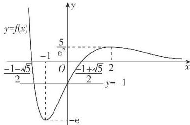

> [!faq]- 答案与解析
>
> > [!success]- **【答案】** ACD
>
> > [!note]- **【解析】**
> > ACD 【解析】 $f'(x)=\frac{-x^{2}+x+2}{e^{x}}=\frac{-(x-2)(x+1)}{e^{x}}$ 由 $f'(x)<0$ 解得 x<-1 或 x>2，由 $f'(x)>0$ 解得 -1<x<2，
> > 所以 $f(x)$ 在 $(-∞,-1)$ 和 $(2,+∞)$ 上单调递减，在 $(-1,2)$ 上单调递增，则-1,2分别是 $f(x)$ 的极小值点和极大值点，A正确.
> > 当 k=0 时，令 $f(x)=\frac{x^{2}+x-1}{e^{x}}=0$ ，即 $x^{2}+x-1=0$ ，解得 $x=\frac{-1\pm\sqrt{5}}{2}$ 所以此时关于 x 的方程 $f(x)=k$ 有且仅有两个实根，故 B 错误. $f(-1)=-e,f(2)=\frac{5}{e^{2}}$ , 当 $x\to-\infty$ 时， $f(x)\rightarrow+\infty$ , 当 $x\rightarrow+\infty$ 时， $f(x)\rightarrow0^{+}$ ，结合函数 $f(x)$ 的单调性画出函数 $f(x)$ 的大致图象如图所示.
> >
> > 
> >
> > 对于关于 x 的方程 $f(f(x)) = -1$ ，令 $t = f(x)$ ，注意到 $f(0) = -1$ ，
> > 观察图象可知 $f(t) = -1$ 有两根，设为$t_{1},t_{2}$ ，且规定 $t_{1}<t_{2}$ ，
> > 则有 $\frac{-1-\sqrt{5}}{2}<t_{1}<-1<0=t_{2}$ ，其中 $\frac{-1-\sqrt{5}}{2}$ 是 $f(x)$ 的一个零点。若 $f(x)=t_{2}=0$ ，则有两个根 $x_{1}=\frac{-1-\sqrt{5}}{2}$ ， $x_{2}=\frac{-1+\sqrt{5}}{2}$ ，若 $f(x)=t_{1}$ ，而 $-e<\frac{-1-\sqrt{5}}{2}<t_{1}<-1<0=t_{2}$ ，
> > 观察图象可知 $f(x)=t_{1}$ 也有两个根。
> > 综上所述，关于x的方程 $f(f(x))=-1$ 共有4个实根，故C正确。
> > 由于 $f(1)+f(-1)=\frac{1}{e}-e<0=a+(-a)$ ，故 $f(1)<a$ 或 $f(-1)<-a$ ，
> > → 点悟：否则 $f(1)\geqslant a$ 且 $f(-1)\geqslant-a$ ，则 $f(1)+f(-1)\geqslant a+(-a)=0$ ，这与 $f(1)+f(-1)=\frac{1}{e}-e<0$ 矛盾
> > 即 $f(1)<a\cdot1$ 或 $f(-1)<a\cdot(-1)$ ，又 $f(0)=-1<0=0\times a$ 恒成立，故 $f(x)\leqslant ax$ 至少有两个整数解，D正确。
> >
> > 故选 **ACD**.
