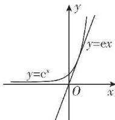

> [!faq]- 答案与解析
>
> > [!success]- **【答案】** $(- \infty, e]$
>
> > [!note]- **【解析】**
> > 由题意知， $f(x)$ 的定义域为 $(0, +\infty)$ ， $f'(x) = \frac{\mathrm{e}^x(x - 1)}{x^2} + \frac{k(1 - x)}{x} = \frac{(\mathrm{e}^x - kx)(x - 1)}{x^2}$ 。因为函数 $f(x)$ 有唯一的极值点，所以1是函数 $f(x)$ 的唯一极值点，所以 $y = \mathrm{e}^x - kx$ 在 $(0, +\infty)$ 上无零点或无变号零点。令 $g(x) = \mathrm{e}^x - kx$ ，则 $g'(x) = \mathrm{e}^x - k$ ，当 $k \leqslant 0$ 时， $g'(x) = \mathrm{e}^x - k > 0$ 恒成立，所以 $g(x)$ 在 $(0, +\infty)$ 上单调递增，且 $g(0) = 1$ ，所以 $g(x) = 0$ 在 $(0, +\infty)$ 上无解，符合题意。当 $k > 0$ 时， $g'(x) = \mathrm{e}^x - k = 0$ 有解，且 $x = \ln k$ ，又 $0 < x < \ln k$ 时， $g'(x) < 0$ ，所以 $g(x)$ 在 $(0, \ln k)$ 上单调递减，当 $x > \ln k$ 时， $g'(x) > 0$ ，所以 $g(x)$ 在 $(\ln k, +\infty)$ 上单调递增，所以 $g(x)_{\min} = g(\ln k) = k - k\ln k \geqslant 0$ 。令 $h(x) = x - x\ln x$ ，则 $h'(x) = 1 - (1 + \ln x) = -\ln x$ ，令 $h'(x) = 0$ ，则 $x = 1$ ，当 $x \in (0, 1)$ 时， $h'(x) > 0$ ，当 $x \in (1, +\infty)$ 时， $h'(x) < 0$ ，所以 $h(x)$ 在 $(0, 1)$ 上单调递增，在 $(1, +\infty)$ 上单调递减。又 $x \to 0^+$ 时， $h(x) \to 0^+$ ， $h(e) = 0$ ，所以 $h(x) \geqslant 0$ 的解集为 $(0, e]$ ，即 $k - k\ln k \geqslant 0$ 的解集为 $(0, e]$ 。当 $k = e$ 时，作出函数 $y = \mathrm{e}^x$ 和 $y = ex$ 的图象，如图所示。
> >
> > 
> >
> > 由导数的几何意义易知直线 y = ex 是曲线 $y = e^{x}$ 在点 $(1, e)$ 处的切线，所以符合题意.
> >
> > $$
> > , k \in (- \infty , e ]
> > $$
