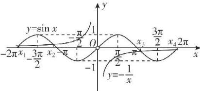

> [!faq]- 答案与解析
>
> > [!success]- **【答案】** D
>
> > [!note]- **【解析】**
> > D 【解析】A 选项, $f'(x) = \cos x - x\sin x - \cos x - 1 = -x\sin x - 1$ , 故 $f'(0) = -1$ , 所以 $f(x)$ 的图象在点 $(0, 0)$ 处的切线方程为 $y = -x$ , A 错误; B 选项, 当 $x \in [0, \pi)$ 时, $f'(x) < 0$ 恒成立, 故 $f(x)$ 在 $[0, \pi)$ 上单调递减, B 错误; C, D 选项, 显然 $f'(0) \neq 0$ , 当 $x \neq 0$ 时, 令 $f'(x) = 0$ , 则 $-x\sin x - 1 = 0$ , 所以 $\sin x = -\frac{1}{x}$ , 分别作出 $y = \sin x$ 和 $y = -\frac{1}{x}$ 在 $[-2\pi, 0) \cup (0, 2\pi]$ 上的图象, 如图所示, 点悟: 方程 $\sin x = -\frac{1}{x}$ 的根及根的个数都很难分析, 此时作出两个函数的图象不失为一种好的办法
> >
> > 
> >
> > 由图可知，这两个函数的图象在区间 $[-2\pi, 0) \cup (0, 2\pi]$ 上共有4个公共点，且两个函数图象在这些公共点处都不相切，
> > 其中当 $x \in (-2\pi, x_1)$ 时， $\sin x < -\frac{1}{x}$ ， $f'(x) = -x \sin x - 1 < 0$ ，
> > 当 $x \in (x_1, x_2)$ 时， $\sin x > -\frac{1}{x}, f'(x) = -x \sin x - 1 > 0$ ，
> > 当 $x \in (x_2, 0)$ 时， $\sin x < -\frac{1}{x}, f'(x) = -x \sin x - 1 < 0$ ，
> > 故 $x_1$ 为极小值点， $x_2$ 为极大值点，同理可得 $x_3$ 为极小值点， $x_4$ 为极大值点，故 $f(x)$ 在区间 $[-2\pi, 2\pi]$ 上的极值点的个数为4，有2个极大值点，C错误，D正确.
> >
> > 故选 **D**.
