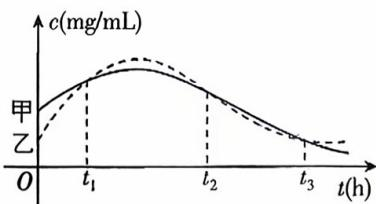

<!-- question-source:start -->
3.[黑龙江哈尔滨2025高二期末]为了评估某种治疗肺炎药物的疗效,有关部门对该药物在人体血管中的药物浓度进行测量.设该药物在人体血管中药物浓度c与时间t的关系为 $c=f(t)$ ，甲、乙两人服用该药物后，血管中药物浓度随时间t变化的关系如图所示.则下列四个结论中错误的是()

A. 在 $t_1$ 时刻, 甲、乙两人血管中的药物浓度相同
B. 在 $t_2$ 时刻, 甲、乙两人血管中药物浓度的瞬时变化率不同
C. 在 $[t_2, t_3]$ 这个时间段内, 甲、乙两人血管中药物浓度的平均变化率相同
D. 在 $[t_1, t_2], [t_2, t_3]$ 两个时间段内, 甲血管中药物浓度的平均变化率相同
<!-- question-source:end -->

![[Q00070330A1]]
