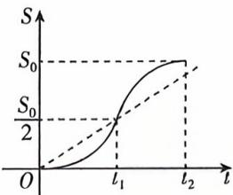

<!-- question-source:start -->
4. (多选)[辽宁部分学校2025高二月考]午饭时间,小明同学从教室到食堂的路程S与时间t的函数关系如图,记t时刻的瞬时速度为V(t),区间 $[0,t_{1}],[0,t_{2}],[t_{1},t_{2}]$ 上的平均速度没有风暴的海洋,只能成为池塘

√ 建议用时:25 分钟 答案 P123

分别为 $V_{1}, V_{2}, V_{3}$ ，则下列判断正确的有（）

A. $V_{1} < V_{2} < V_{3}$ B. $\frac{V_1 + V_3}{2} < V_2$ C.对于 $V_{i}(i = 1,2,3)$ ，存在 $m_i\in (0,t_2)$ ，使得 $V(m_i) = V_i$ D.整个过程小明行走的速度一直在加快
<!-- question-source:end -->

![[Q00070331A1]]
