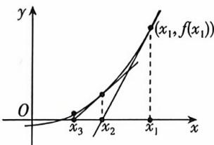

<!-- question-source:start -->
6. 教材变式(多选)[陕西西安铁一中滨河高级中学2024高二月考]牛顿(1643—1727)在《流数建议用时:30 分钟 答案 P126

法》一书中,给出了高次代数方程的一种数值解法——牛顿法,用“作切线”的方法求函数零点.如图,在横坐标为 $x_{1}$ 的点处作曲线 $f(x)$ 的切线,切线与x轴交点的横坐标为 $x_{2}$ ;用 $x_{2}$ 代替 $x_{1}$ 重复上面的过程得到 $x_{3}$ ;一直下去,得到数列 $\{x_{n}\}$ ,叫做牛顿数列.若函数 $f(x)=x^{2}-x-6,a_{n}=\ln\frac{x_{n}+2}{x_{n}-3}$ 且 $a_{1}=1,x_{n}>3$ ,数列 $\{a_{n}\}$ 的前n项和为 $S_{n}$ ,则下列说法正确的是()

A. $x_{n + 1} = x_n - \frac{f(x_n)}{f'(x_n)}$ B.数列 $\{a_{n}\}$ 是递减数列C.数列 $\{a_{n}\}$ 是等比数列D. $S_{2024} = 2^{2023} - 1$
<!-- question-source:end -->

![[Q00070376A1]]
