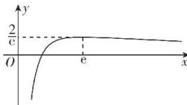

> [!faq]- 答案与解析
>
> > [!success]- **【答案】** D
>
> > [!note]- **【解析】**
> > D 【解析】 $f(x)=\frac{1}{3}x^{3}-\frac{a^{x}}{\ln a}$ ，则 $f'(x)=x^{2}-a^{x}$ ，要使函数 $f(x)=\frac{1}{3}x^{3}-$ $\frac{a^{x}}{\ln a}$ 在其定义域 $(0,+\infty)$ 内既有极大值也有极小值，只需方程 $x^{2}-a^{x}=0$ 在 $(0,+\infty)$ 上有两个不相等的实数根，即 $\ln a=\frac{2\ln x}{x}$ 在 $(0,+\infty)$ 上有两个不相等的实数根。令 $g(x)=\frac{2\ln x}{x}$ ，则 $g'(x)=\frac{2(1-\ln x)}{x^{2}}$ 。当 $x\in(0,e)$ 时， $g'(x)>0$ ，当 $x\in(e,+\infty)$ 时， $g'(x)<0$ ，所以 $g(x)$ 在 $(0,e)$ 上单调递增，在 $(e,+\infty)$ 上单调递减，当 x>1 时， $g(x)>0$ ，且 $g(e)=\frac{2}{e}$ ，当 $x\to+\infty$ 时， $g(x)\to0$ ，当 $x\to0^{+}$ 时， $g(x)\to-\infty$ ，则 $g(x)$ 的大致图象如图所示。
> >
> > 
> >
> > $$
> > \ln a \in \left(0, \frac {2}{e}\right)
> > $$
> >
> > $$
> > 1 <   a <   \mathrm{e} ^ {\frac {2}{\mathrm{e}}}
> > $$
