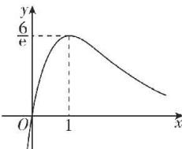

> [!faq]- 答案与解析
>
> > [!success]- **【答案】** A
>
> > [!note]- **【解析】**
> > A 【解析】∵ $f'(x) = ae^{x} - 6x = e^{x} \cdot \left(a - \frac{6x}{e^{x}}\right)$ ，令 $g(x) = \frac{6x}{e^{x}}$ ，∴ $g'(x) = \frac{6(1-x)}{e^{x}}$ 当 x<1 时， $g'(x)>0$ ，此时 $g(x)$ 在 $(-∞,1)$ 上单调递增；
> > 当 x>1 时， $g'(x)<0$ ，此时 $g(x)$ 在 $(1, +∞)$ 上单调递减.
> > 由 $g(0)=0$ ，当 $x\to+\infty$ 时， $g(x)\to0$ ，故可作出 $g(x)$ 的大致图象如图，
> >
> > 
> >
> > $\therefore g(x)_{\max} = g(1) = \frac{6}{\mathrm{e}},$ $\therefore$ 当 $a\geqslant \frac{6}{\mathrm{e}}$ 时，则 $a - \frac{6x}{\mathrm{e}^x}\geqslant 0$ ，则 $f^{\prime}(x)\geqslant 0$ 且不恒为 $0,f(x)$ 在 $\mathbb{R}$ 上单调递增，因此当 $x\in [0,2]$ 时， $f(x)$ 在 $x = 2$ 处取得最大值，不满足题意；
> > 当 $a\leqslant 0$ 时，当 $x\in [0,2]$ 时， $f^{\prime}(x)\leqslant 0$ 且不恒为 $0,f(x)$ 在[0,2]上单调递减，此时 $f(x)$ 在 $x = 0$ 处取得最大值，满足题意；
> > 当 $0 <   a <   \frac{6}{\mathrm{e}}$ 时，由图知 $a - \frac{6x}{\mathrm{e}^x} = 0$ 有两个根 $x_{1},x_{2}(0 <   x_{1} <   1 <   x_{2})$ 当 $x <   x_{1}$ 时， $a - \frac{6x}{\mathrm{e}^x} >0,f'(x) > 0,$ 当 $x_{1} <   x <   x_{2}$ 时， $a - \frac{6x}{\mathrm{e}^x} <  0,f'(x) <   0,$ 当 $x > x_{2}$ 时， $a - \frac{6x}{\mathrm{e}^{x}} > 0, f'(x) > 0,$ $\therefore$ 当 $x \geqslant 0$ 时， $f(x)$ 在 $[0, x_{1}], [x_{2}, +\infty)$ 上单调递增，在 $(x_{1}, x_{2})$ 上单调递减，显然当 $x \in [0, 2]$ 时 $f(x)$ 不会在 $x = 0$ 处取得最大值，不满足题意.
> > 综上可知， $a$ 的取值范围为 $(- \infty, 0]$ .
> >
> > 故选 **A**.
