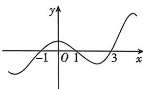

<!-- question-source:start -->
2.[福建福州外国语学校2025高二期中]已知函数 $f(x)$ 的定义域为R,其导函数为 $f'(x)$ , $f'(x)$ 的部分图象如图所示,则()

A. $f(x)$ 在 $(3, +\infty)$ 上单调递增
B. $f(x)$ 的最大值为 $f(1)$ C. $f(x)$ 的一个极大值点为-1
D. $f(x)$ 的一个减区间为 $(1, 3)$
<!-- question-source:end -->

![[Q00070568A1]]
