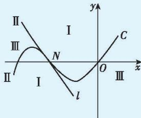

> [!faq]- 答案与解析
>
> > [!success]- **【答案】** AD
>
> > [!note]- **【解析】**
> > AD 【解析】对于 A: 当 a=1 时, $f(x)=x^{3}-x+1$ , 则 $f'(x)=3x^{2}-1$ , $f''(x)=6x$ , 令 $f''(x)=0$ , 解得 x=0, 又 $f(0)=1$ , $f'(0)=-1$ , 所以曲线 $y=f(x)$ 在拐点处的切线方程为 $y=-x+1$ , 即 $x+y-1=0$ , 故 A 正确.
> > 对于 B: 当 a=3 时, $f(x)=x^{3}-3x+1$ , 则 $f'(x)=3x^{2}-3$ , 所以当 -1<x<1 时, $f'(x)<0$ , 当 x<-1 或 x>1 时, $f'(x)>0$ , 所以 $f(x)$ 在 $(-1,1)$ 上单调递减, 在 $(-∞,-1)$ , $(1,+∞)$ 上单调递增,
> >
> > 所以 $f(x)$ 在 x=1 处取得极小值 $f(1)=-1$ . 又 $f(-2)=-1$ ,
> >
> > 要使函数 $y=f(x)$ 在区间 $(m,m+5)$ 内存在最小值, 则 $\left\{\begin{aligned}-2&\leqslant m<1,\\ m+5&>1,\end{aligned}\right.$ 解得 $-2\leqslant m<1$ , 即 m 的取值范围是 $[-2,1)$ , 故 B 错误.
> >
> > 对于 C: $f(x)=x^{3}-ax+1(a\in\mathbb{R})$ , 则 $f'(x)=3x^{2}-a$ , 设切点为 $(t,t^{3}-at+1)$ ,
> >
> > 则 $f'(t)=3t^{2}-a$ , 所以切线方程为 $y-(t^{3}-at+1)=(3t^{2}-a)(x-t)$ ,
> >
> > 又切线过点 $(1,2)$ , 所以 $2-(t^{3}-at+1)=(3t^{2}-a)(1-t)$ ,
> >
> > 整理得 $a=-2t^{3}+3t^{2}-1$ .
> >
> > 令 $m(t)=-2t^{3}+3t^{2}-1$ , 则 $m'(t)=-6t^{2}+6t=-6t(t-1)$ ,
> >
> > 所以当 0<t<1 时, $m'(t)>0$ , 当 t<0 或 t>1 时, $m'(t)<0$ ,
> >
> > 所以 $m(t)$ 在 $(0,1)$ 上单调递增, 在 $(-∞,0), (1,+∞)$ 上单调递减,
> >
> > 所以 $m(t)$ 在 t=0 处取得极小值, 在 t=1 处取得极大值, 且 $m(0)=-1$ , $m(1)=0$ .
> >
> > 因为经过点 $(1,2)$ 可以向曲线 $y=f(x)$ 作三条切线, 即直线 y=a 与 $m(t)$ 的图象有三个交点, 所以 -1<a<0, 即 a 的取值范围是 $(-1,0)$ , 故 C 错误.
> >
> > 对于 D: 由 $\left\{\begin{aligned}y&=-a\cdot(x-x_{0})+f(x_{0}),\\ y&=x^{3}-ax+1,\end{aligned}\right.$ 得 $x^{3}-ax+1=-a(x-x_{0})+x_{0}^{3}-ax_{0}+1$ ,
> >
> > 即 $x^{3}=x_{0}^{3}$ , 显然 $y=x^{3}$ 在 R 上单调递增, 所以 $x=x_{0}$ , 即对任意实数 $x_{0}$ , 直线 $y=-a(x-x_{0})+f(x_{0})$ 与曲线 $y=f(x)$ 有唯一公共点, 故 D 正确. 故选 AD.
> >
> > 多种解法 对于 C: $f'(x)=3x^{2}-a$ , $f''(x)=6x$ , 令 $f''(x)=0$ , 得 x=0, 即三次函数图象的对称中心为 N(0,1). 又 $f'(0)=-a$ , 则三次函数图象在点 N 处的切线 l 的方程为 $y=-ax+1$ , 记 $g(x)=-ax+1$ .
> >
> > 若过点 $(1,2)$ 可以作曲线 $y=f(x)$ 的三条切线, 则 $g(1)<2<f(1)$ , 即 $-a+1<2<2-a$ , 解得 -1<a<0. 故 C 错误.
> >
> > 二级结论 过平面内一点作三次函数图象的切线的条数
> > 三次函数 $f(x)=ax^{3}+bx^{2}+cx+d(a>0)$ ，设三次函数图象 C 在其对称中心 N 处的切线为 l, M 是三次函数图象 C 所在平面上的一点，则
> > （Ⅰ）过点 M 能且仅能作 C 的一条切线，当且仅当点 M 位于 C 和 l 所夹的上、下两个区域内（边界除外），或点 M 与点 N 重合；
> > （Ⅱ）过点 M 能且仅能作 C 的两条切线，当且仅当点 M 位于图象 C 或切线 l 上（点 N 除外）；
> > （Ⅲ）过点 M 能且仅能作 C 的三条切线，当且仅当点 M 位于 C 和 l 所夹的左、右两个区域内（边界除外）.
> >
> > 
