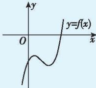

> [!faq]- 答案与解析
>
> > [!success]- **【答案】** A
>
> > [!note]- **【原始答案】** 详见解析
>
> > [!note]- **【解析】**
> > (1)【解】由 $f(x)=(x-1)^{3}-ax-b$ ，可得 $f'(x)=3(x-1)^{2}-a$ 。
> > 下面分两种情况讨论：
> > - **①**：当 $a\leqslant0$ 时， $f'(x)=3(x-1)^{2}-a\geqslant0$ 且等号不恒成立，所以 $f(x)$ 的单调递增区间为 $(-∞,+∞)$ ，无单调递减区间。
> > - **②**：当a>0时，令 $f'(x)=0$ ，解得 $x=1+\frac{\sqrt{3a}}{3}$ 或 $x=1-\frac{\sqrt{3a}}{3}$ .
> > 当x变化时， $f'(x)$ ， $f(x)$ 的变化情况如表所示.
> >
> > <table><tr><td>x</td><td>f&#x27;(x)</td><td>f(x)</td></tr><tr><td>(-∞,1-√3a/3)</td><td>+</td><td>单调递增</td></tr><tr><td>1-√3a/3</td><td>0</td><td>极大值</td></tr><tr><td>(1-√3a/3,1+√3a/3)</td><td>-</td><td>单调递减</td></tr><tr><td>1+√3a/3</td><td>0</td><td>极小值</td></tr><tr><td>(1+√3a/3,+∞)</td><td>+</td><td>单调递增</td></tr></table>
> >
> > 所以 $f(x)$ 的单调递减区间为 $\left(1-\frac{\sqrt{3a}}{3},1+\frac{\sqrt{3a}}{3}\right)$ ，单调递增区间为 $\left(-\infty,1-\frac{\sqrt{3a}}{3}\right),\left(1+\frac{\sqrt{3a}}{3},+\infty\right)$ .
> > (2)【证明】因为 $f(x)$ 存在极值点，所以由(1)知 a>0，且 $x_{0}\neq1$ 由题意，得 $f'(x_0)=3(x_0-1)^2-a=0$ 即 $(x_{0}-1)^{2}=\frac{a}{3}$ ，所以 $f(x_{0})=(x_{0}-1)^{3}-ax_{0}-b=-\frac{2a}{3}x_{0}-\frac{a}{3}-b.$ 又 $f(3-2x_{0})=(2-2x_{0})^{3}-a(3-2x_{0})-b=\frac{8a}{3}(1-x_{0})+2ax_{0}-3a-b=-\frac{2a}{3}x_{0}-\frac{a}{3}-b=f(x_{0})$ ，且 $3-2x_{0}\neq x_{0}$ ，由(1)知，
> > 存在唯一实数 $x_{1}$ 满足 $f(x_{1})=f(x_{0})$ ，
> > 且 $x_{1} \neq x_{0}$ ，因此 $x_{1}=3-2x_{0}$ ，所以 $x_{1}+2x_{0}=3$ .
> >
> > 名师点拨 要证明 $x_{1}+2x_{0}=3$ ，即证明自变量间的关系，从函数的思想来看，可以利用函数的单调性转化为证明函数值间的关系。但是很显然原始形式不好直接求函数值，所以转化为证明 $x_{1}=3-2x_{0}$ ，即研究 $f(x_{1})$ 与 $f(3-2x_{0})$ 的关系，进而结合单调性证明 $x_{1}=3-2x_{0}$ 。
> >
> > 多种解法 因为 $f(x)$ 存在极值点，所以由(1)知 a>0，且 $x_{0}\neq1$ ，作出函数 $f(x)$ 的大致图象如图所示.
> >
> > 
> >
> > 由 $x_0$ 为极值点，结合图象可知 $f(x) = f(x_0)$ 有3个根 $x_{1}, x_{0}, x_{0}$ ，即 $(x - 1)^{3} - ax - b - f(x_{0}) = 0$ ，即 $x^{3} - 3x^{2} + (3 - a)x - 1 - b - f(x_{0}) = 0$ 有3根 $x_{1}, x_{0}, x_{0}$ ，故 $x^{3} - 3x^{2} + (3 - a)x - 1 - b - f(x_{0}) = (x - x_{1})(x - x_{0})^{2}$ ，即 $x^{3} - 3x^{2} + (3 - a)x - 1 - b - f(x_{0}) = x^{3} - (x_{1} + 2x_{0})x^{2} + (x_{0}^{2} + 2x_{0}x_{1})x - x_{1}x_{0}^{2}$ ，所以 $x_{1} + 2x_{0} = 3$ .
