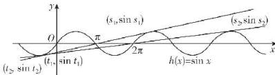

> [!faq]- 答案与解析
>
> > [!success]- **【答案】** A
>
> > [!note]- **【原始答案】** 详见解析
>
> > [!note]- **【解析】**
> > (1)【解】直线 $y = 2x$ 是曲线 $f(x) = x^3 + \frac{1}{x}$ 的“双重切线”，理由如下： $f(x) = x^3 + \frac{1}{x}$ 的定义域为 $(- \infty, 0) \cup (0, +\infty)$ ，求导得 $f'(x) = 3x^2 - \frac{1}{x^2}$ 。
> > 令 $f'(x) = 3x^2 - \frac{1}{x^2} = 2$ ，解得 $x = \pm 1$ ，不妨设切点为 $P(-1, -2), Q(1, 2)$ ，则曲线 $f(x)$ 在点 $P$ 处的切线方程为 $y + 2 = 2(x + 1)$ ，即 $y = 2x$ ，在点 $Q$ 处的切线方程为 $y - 2 = 2(x - 1)$ ，即 $y = 2x$ ，所以直线 $y = 2x$ 是曲线 $f(x) = x^3 + \frac{1}{x}$ 的“双重切线”。
> > (2)【解】函数 $g(x) = \begin{cases} e^x - \frac{2}{e}, & x \leqslant 0, \\ \ln x, & x > 0, \end{cases}$ 求导得 $g'(x) = \begin{cases} e^x, & x \leqslant 0, \\ \frac{1}{x}, & x > 0, \end{cases}$ 显然函数 $y = e^x$ 在 $(- \infty, 0)$ 上单调递增，函数 $y = \frac{1}{x}$ 在 $(0, +\infty)$ 上单调递减，设切点为 $P(x_1, y_1), Q(x_2, y_2)$ ，则存在 $x_1 < 0 < x_2$ ，使得 $g'(x_1) = g'(x_2)$ ，则曲线 $g(x)$ 在点 $P$ 处的切线方程为 $y - \left(e^{x_1} - \frac{2}{e}\right) = e^{x_1}(x - x_1)$ ，在点 $Q$ 处的切线方程为 $y - \ln x_2 = \frac{1}{x_2}(x - x_2)$ ，因此 $\left\{ \begin{array}{l} e^{x_1} = \frac{1}{x_2}, \\ e^{x_1} - e^{x_1} x_1 - \frac{2}{e} = \ln x_2 - 1, \end{array} \right.$ 消去 $x_2$ 可得 $e^{x_1} - x_1 e^{x_1} + x_1 - \frac{2}{e} + 1 = 0.$ 令 $k(x) = e^x - xe^x + x - \frac{2}{e} + 1 (x < 0)$ ，求导得 $k'(x) = e^x - (1 + x)e^x + 1 = -xe^x + 1 > 0,$ 则函数 $k(x)$ 在 $(- \infty, 0)$ 上单调递增，又 $k(-1) = 0$ ，则函数 $k(x)$ 的零点为-1，因此 $x_1 = -1, x_2 = e,$ 所以曲线 $y = g(x)$ 的“双重切线”的方程为 $y = \frac{x}{e}$ .
> > (3)【证明】设直线 $PQ$ 的斜率为 $k_1$ 时对应的切点为 $(t_1, \sin t_1), (s_1, \sin s_1), t_1 < s_1, k_2$ 时对应的切点为 $(t_2, \sin t_2), (s_2, \sin s_2), t_2 < s_2.$ 由 $(\sin x)' = \cos x$ ，得 $k_1 = \cos t_1 = \cos s_1, k_2 = \cos t_2 = \cos s_2.$ 如图所示，由诱导公式及余弦函数的
> >
> > $$
> > t _ {1} + s _ {1} = 2 \pi , t _ {2} +
> > $$
> >
> > 
> >
> > 周期性知，只需考虑 $t_1 + s_1 - 2\pi, t_2 + s_2 = 4\pi$ ，其中 $t_1, t_2 \in \left(-\frac{\pi}{2}, 0\right)$ ，由 $k_1 > k_2$ 及余弦函数 $y = \cos x$ 在 $\left(-\frac{\pi}{2}, 0\right)$ 上单调递增知， $-\frac{\pi}{2} < t_2 < t_1 < 0$ ，则 $k_1 = \frac{\sin s_1 - \sin t_1}{s_1 - t_1} = \frac{\sin(2\pi - t_1) - \sin t_1}{(2\pi - t_1) - t_1} = -\frac{2\sin t_1}{2\pi - 2t_1} = -\frac{\sin t_1}{\pi - t_1}$ ， $k_2 = \frac{\sin s_2 - \sin t_2}{s_2 - t_2} = \frac{\sin(4\pi - t_2) - \sin t_2}{(4\pi - t_2) - t_2} = -\frac{2\sin t_2}{4\pi - 2t_2} = -\frac{\sin t_2}{2\pi - t_2}$ ，
> >
> > ## 刷难关
