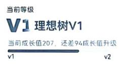
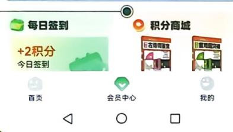
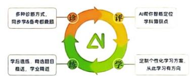

<!-- question-source:start -->
19. (本小题满分 17 分) [重庆西南大学附属中学 2025 诊断性考试] 已知函数 $f(x) = \mathrm{e}^{x}, g(x) = kx^{2} + k, k \in \mathbb{R}$ .

(1) 过原点作直线 $l$ 与 $f(x), g(x)$ 的图象均相切, 求实数 $k$ 的值.

(2) 令 $h(x) = f(x) - g(x)$ ,

(i) 讨论 $h(x)$ 的极值点个数；

(ii) 若 $x_{1}$ 为 $h(x)$ 的极小值点, $x_{0}$ 为 $h(x)$ 的零点, 求证: $2x_{1} > x_{0}$ .

# “理想树图书”专属【会员&增值】服务平台

小程序

## The image provided is a QR code. It does not contain any text, mathematical formulas, tables, or figures that can be processed according to the OCR instructions. Therefore, no textual content can be extracted from this image.

会员中心

微信扫图书背面二维码注册会员

会员领券

周六抽奖

错题打印

本书增值扫码获取

动书600+本动态教辅书同步更新

图书兑换

学法全学科知识总结与学法提炼

你的笔记必须C位出道 【VOA】慢速如何写好一封电子邮件？

图书增值
全套资源，一键畅享

诊评学练，一步到位，智能伴学，学业精进

错题本边学边攒错题

AI改作文
AI智能批改，专业写作帮手

活动专区

## 青藤计划

{以书载梦，以行践责
——青藤计划公益项目}

理想树联合中国光华科技基金会共建公益助学行动，设立100万专项基金。每一笔善款都经由国家级4A基金会专业运作，让善意在阳光下开枝散叶。

若您身边有亟需帮助的学子，请以学校为单位与我们联系，我们与您携手并肩，为每一个理想全力以赴。

邮箱地址：67book@lxzwedu.com
联系电话：400-688-9167

每一页笔记，都是你写给未来自己的一封信，是“刻进纸张的时光勋章”。现在，我们邀请你晒出学习笔记，共同见证你的努力与成长！

在堆满习题的课桌前，在无数个挑灯夜战的瞬间，你的笔尖早已悄悄记录下青春最滚烫的模样。那些用荧光笔反复勾画的重点，那些写满批注的错题，那些突然灵感迸发的解题思路……

## 刻进纸张的时光勋章

致每一位高二的追光者：

## 活动时间

2025年10月1日—2026年5月31日

刷题小手 点点关注

▶扫码参与活动，晒出你的笔记，即有机会获得精美礼品！

[媒体号]

@理想树高中

@众望教育集团

bilibili

@理想树图书官方号

@理想树图书官方

小红书

@理想树必刷题 试题网
www.stzy.com

众望教育官网
www.lxzwedu.com

The Ground Truth image displays a single, solid horizontal line. According to Rule 2 (UNDERSCORE & LINE RULES), this is a stylistic or background line, not a placeholder underscore. Therefore, the OCR result must ignore it. The provided OCR content is "\_\_\_\_", which consists of four underscores. This is an incorrect interpretation of the line as a placeholder, violating the rule that stylistic lines must be ignored. The OCR has hallucinated text (underscores) where none should exist in the GT. This adheres to the strict requirement to ignore such lines.
<!-- question-source:end -->

![[Q00070638A1]]
