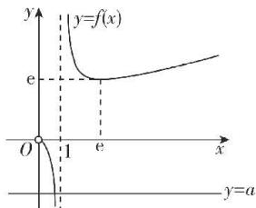

> [!faq]- 答案与解析
>
> > [!success]- **【答案】** BD
>
> > [!note]- **【解析】**
> > BD 【解析】函数 $f(x) = \frac{x}{\ln x}, x \in (0, 1) \cup (1, +\infty)$ ，则 $f'(x) = \frac{\ln x - 1}{(\ln x)^2}$ ，令 $f'(x) < 0$ ，得 $0 < x < 1$ 或 $1 < x < e$ ；令 $f'(x) > 0$ ，得 $x > e$ . 所以函数 $f(x)$ 在 $(0, 1), (1, e)$ 上单调递减，在 $(e, +\infty)$ 上单调递增， $x \to 0^+$ 时， $f(x) \to 0; x \to 1^-$ 时， $f(x) \to -\infty; x \to 1^+$ 时， $f(x) \to +\infty; x \to +\infty$ 时， $f(x) \to +\infty$ ，故 $f(x)$ 的大致图象如图所示.
> >
> > 
> >
> > 对于 A, 由上述分析可得 A 错误;
> > 对于 B, 由 $f'(e^{2}) = \frac{\ln e^{2} - 1}{(\ln e^{2})^{2}} = \frac{1}{4}$ , $f(e^{2})=\frac{e^{2}}{2}$ ，得所求切线方程为 $y-\frac{e^{2}}{2}=\frac{1}{4}(x-e^{2})$ ，即 $x-4y+e^{2}=0$ ，故 B 正确；
> > 对于 C，方程 $a \ln x = x$ 只有一个解即方程 $f(x) = \frac{x}{\ln x} = a$ 只有一个解，由图象可知，a=e 或 a<0，故 C 错误；
> > 对于 D，设函数 $g(x)(x \in \mathbb{R})$ 的值域为 G，函数 $f(x)(x \in (1, +\infty))$ 的值域为 E，对于 $g(x)=x^{2}+a, G=[a,+\infty)$ ，
> > 对于 $f(x), E=[e,+\infty)$ 若 $\forall x_{1}\in R,\exists x_{2}\in(1,+\infty)$ ，使得 $g(x_{1})=f(x_{2})$ 成立，则 $G\subseteq E$ ，所以 $a\geqslant e$ ，故 D 正确。
> >
> > 故选 **BD**。
