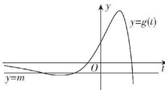

> [!faq]- 答案与解析
>
> > [!success]- **【答案】** A
>
> > [!note]- **【原始答案】** 3 $\left(-\frac{5}{\mathrm{e}^2},0\right)$
>
> > [!note]- **【解析】**
> > 设切点为 $(t, te^t)$ ，对函数 $f(x)$ 求导得 $f'(x) = (x + 1)\mathrm{e}^x$ ，则切线斜率为 $f'(t) = (t + 1)\mathrm{e}^t$ ，所以曲线 $y = f(x)$ 在点 $(t, te^t)$ 处的切线方程为 $y - te^t = (t + 1)\mathrm{e}^t (x - t)$ ，将点 $P$ 的坐标代入切线方程可得 $m - te^t = (t + 1)\mathrm{e}^t (1 - t)$ ，所以 $m = (-t^2 + t + 1)\mathrm{e}^t$ 。令 $g(t) = (-t^2 + t + 1)\mathrm{e}^t, t \in \mathbb{R}$ ，所以 $g'(t) = (-t^2 - t + 2)\mathrm{e}^t = -(t + 2)$ 。
> >
> > $(t-1)e^{t}$ , 列表如下:
> >
> > <table><tr><td>t</td><td>(-∞,-2)</td><td>-2</td><td>(-2,1)</td><td>1</td><td>(1,+∞)</td></tr><tr><td>g&#x27;(t)</td><td>-</td><td>0</td><td>+</td><td>0</td><td>-</td></tr><tr><td>g(t)</td><td>单调递减</td><td>-5/e2</td><td>单调递增</td><td>e</td><td>单调递减</td></tr></table>
> >
> > 由 $g(t) < 0$ 可得 $t^2 - t - 1 > 0$ , 解得 $t < \frac{1 - \sqrt{5}}{2}$ 或 $t > \frac{1 + \sqrt{5}}{2}$ , 且 $t \to -\infty$ 时, $g(t) \to 0^{-}, t \to +\infty$ 时, $g(t) \to -\infty$ , 作出函数 $g(t)$ 的大致图象如图所示.
> >
> > 
> >
> > 由图可知，当 $-\frac{5}{\mathrm{e}^2} < m < 0$ 时，直线 $y = m$ 与函数 $g(t)$ 的图象有三个公共点，当 $m = -\frac{5}{\mathrm{e}^2}$ 或 $0 \leqslant m < e$ 时，直线 $y = m$ 与函数 $g(t)$ 的图象有两个公共点，当 $m = e$ 或 $m < -\frac{5}{\mathrm{e}^2}$ 时，直线 $y = m$ 与函数 $g(t)$ 的图象有一个公共点，当 $m > e$ 时，直线 $y = m$ 与函数 $g(t)$ 的图象没有交点.
