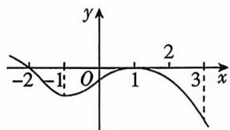

<!-- question-source:start -->
1.[上海闵行三中2025高二期中]已知函数 $f(x)$ 的导函数 $f'(x)$ 的图象如图所示,给出下列结论:
① $f(x)$ 在区间 $(-1,1)$ 上单调递增;
② $f(x)$ 的图象在 x=-2 处的切线斜率等于 0;
③ $f(x)$ 在 x=1 处取得极大值;
④ $f'(x)$ 在 x=-1 处取得极小值.
其中正确的个数是 ( )

A. 1 B. 2 C. 3 D. 4
<!-- question-source:end -->

![[Q00070408A1]]
