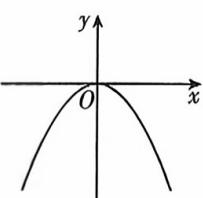
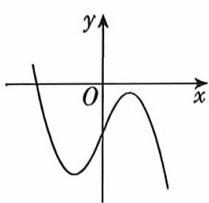
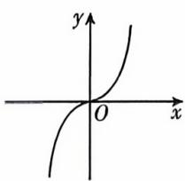
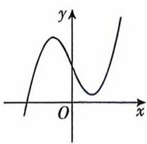

<!-- question-source:start -->
2. (多选) [河北保定十县一中 2025 高二联考] 已知函数 $f(x) = ax^3 + bx^2 + cx + d$ , $ac < 0$ , 则 $f(x)$ 的图象可能是 ( )

A

B

C

D

## 题型2 求函数的极值
<!-- question-source:end -->

![[Q00070409A1]]
