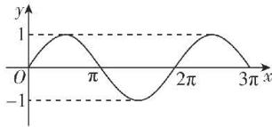

> [!faq]- 答案与解析
>
> > [!success]- **【答案】** D
>
> > [!note]- **【解析】**
> > D【解析】设函数 $f(x)$ 在 $[0,3\pi ]$ 上的“拉格朗日中值点”为 $x_0$ ，由题意可知 $\frac{f(3\pi) - f(0)}{3\pi - 0} = f'(x_0)$ 即 $\frac{\cos 3\pi - \cos 0}{3\pi - 0} = -\sin x_0,$ $\therefore \frac{2}{3\pi} = \sin x_0$ ，函数 $h(x) = \sin x$ 在[0， $3\pi ]$ 上的大致图象如图.
> >
> > 
> >
> > $\because \frac{2}{3\pi} \in (0,1), \therefore$ 直线 $y = \frac{2}{3\pi}$ 与函数 $h(x) = \sin x$ 在 $[0,3\pi]$ 上的图象有4个交点，即方程 $\frac{2}{3\pi} = \sin x_0$ 存在4个不同的解，即“拉格朗日中值点”的个数为4.
> >
> > 故选 **D**.
