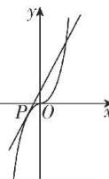

> [!faq]- 答案与解析
>
> > [!success]- **【答案】** C
>
> > [!note]- **【解析】**
> > $\left(\frac{3}{2}, +\infty\right)$ 【解析】依题意得 $ax + 2 = x^3 - ax$ 即方程 $x^3 = 2ax + 2$ 有三个不同的实数根. 假设直线 $y = 2ax + 2$ 与曲线 $y = x^3$ 相切于点 $P(x_0, y_0)$ ,
> >
> > 
> >
> > 则 $\left\{\begin{aligned}x_{0}^{3}&=2ax_{0}+2,\\ 2a&=3x_{0}^{2}\end{aligned}\right.\Rightarrow\left\{\begin{aligned}x_{0}&=-1,\\ a&=\frac{3}{2}.\end{aligned}\right.$ 又直线 $y=2ax+2$ 过定点 $(0,2)$ ，画出函数 $y=x^{3}$ 的图象如图，结合图象可知 $a\in\left(\frac{3}{2},+\infty\right)$ .
> >
> > 调递减; 当 x=0 时, $f'(x)=0$ ; 当 $x\in(0,+\infty)$ 时, $f'(x)>0$ , $f(x)$ 单调递增, 故函数 $f(x)$ 的单调递增区间为 $[0,+\infty)$ , 符合题意. 所以 a=1. 故选 C.
> >
> > 特别注意 函数的单调递增区间为 $[0,+\infty)$ 与函数在 $[0,+\infty)$ 上单调递增含义不同, 前者指的是函数完整的单调递增区间为 $[0,+\infty)$ , 后者指的是 $[0,+\infty)$ 包含于函数的完整的单调递增区间.
