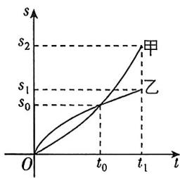

<!-- question-source:start -->
6. (多选) [广东东莞中学 2025 高二段考] 物体甲、乙在时间 0 到 $t_1$ 范围内, 路程的变化情况如图所示, 下列说法正确的是 ( )

A. 在 0 到 $t_0$ 范围内, 甲的平均速度大于乙的平均速度
B. 在 0 到 $t_0$ 范围内, 甲的平均速度等于乙的平均速度
C. 在 $t = t_0$ 时, 甲的瞬时速度大于乙的瞬时速度
D. 在 $t = t_0$ 时, 甲的瞬时速度等于乙的瞬时速度
<!-- question-source:end -->

![[Q00070310A1]]
