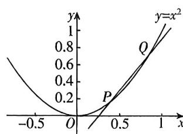

<!-- question-source:start -->
7. 如图, 已知曲线 $y = x^2$ , $P(0.4, 0.16)$ 是曲线上的一点, $Q$ 是曲线上点 $P$ 附近的一个点, 设点 $Q$ 的横坐标为 $x$ , 则割线 $PQ$ 的斜

率是\_\_\_\_（用含 $x$ 的式子表示）.

# 5.1.2 导数的概念及其几何意义课时 $①$ 导数的概念

视频微课

错题本
<!-- question-source:end -->

![[Q00070311A1]]
