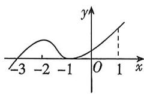

<!-- question-source:start -->
1.[河南信阳高中2025高二月考]已知函数 $f(x)$ 为连续可导函数, $f'(x)$ 是 $f(x)$ 的导函数,

函数 $y=(x+1)f'(x)$ 的图象如图所示, 则以下说法正确的是
A. $f(-1)$ 是函数 $f(x)$ 的最小值
B. $f(-3)$ 是函数 $f(x)$ 的极小值
C. 函数 $f(x)$ 在区间 $(-3,1)$ 上单调递增
D. 曲线 $y=f(x)$ 在 x=0 处的切线的斜率大于 0
<!-- question-source:end -->

![[Q00070430A1]]
