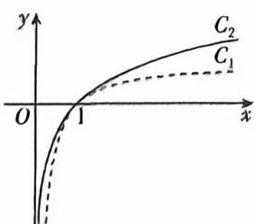

<!-- question-source:start -->
13. 纹材变式 [广东珠海 2025 高二期中] 设 $x > 0$ , $f(x) = \ln x, g(x) = 1 - \frac{1}{x}$ , 两个函数的图象如图所示.

(1) 判断 $f(x), g(x)$ 的图象与 $C_1, C_2$ 之间的对应关系；

(2) 根据 $C_1, C_2$ 的位置关系, 写出一个关于 $f(x)$ 和 $g(x)$ 的不等式, 并证明.
<!-- question-source:end -->

![[Q00070442A1]]
