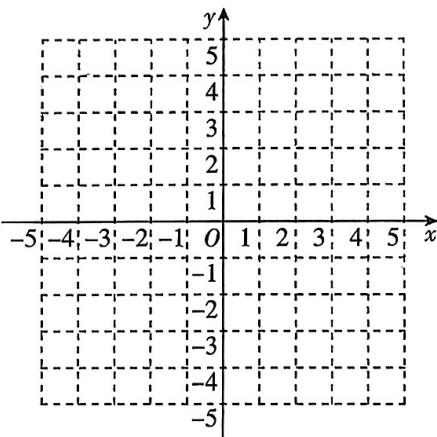

<!-- question-source:start -->
16. 教材变式 [河南周口 2025 高二月考] 已知函数 $f(x)=\frac{\mathrm{e}^{x}(2x-3)}{x+3}.$

(1) 求函数 $f(x)$ 的单调区间与极值;

(2)在所给的平面直角坐标系 $xOy$ 中画出函数 $f(x)$ 的大致图象；

(3) 讨论方程 $f(x) = a (a \in \mathbf{R})$ 的实数解的个数.

<!-- question-source:end -->

![[Q00070445A1]]
