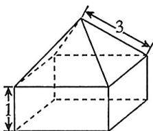

<!-- question-source:start -->
2.[湖北武汉2024月考]如图所示的几何体由一个正四棱锥和一个正四棱柱组合而成.已知正四棱锥的侧棱长为3,正四棱柱的高为1,则该几何体的体积的最大值为()

A.15 B.16 C. $\frac{62}{3}$ D. $\frac{64}{3}$
<!-- question-source:end -->

![[Q00070450A1]]
