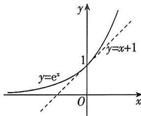

<!-- question-source:start -->
5.[广东深圳实验学校2025高二期中]“切线放缩”是处理不等式问题的一种技巧.如: $y=e^{x}$ 的图象在点(0,1)处的切线为 $y=x+1$ ,如图所示,易知除切点(0,1)外, $y=e^{x}$ 图象上其余所有的点均在直线 $y=x+1$ 的上方,故有 $e^{x}\geqslant x+1$ ,该结论可通过构造函数 $f(x)=e^{x}-x-1$ 并求其最小值来证明. 显然, 我们选择的切点不同, 所得的不等式也不同. 请根据以上材料, 判断下列命题中正确命题的个数是 ( )

① $\forall x>0, e^{x-1} \geqslant \ln x+1;$ ② $\forall a \in R, \forall x \in R, e^{x} \geqslant e^{a}(x-a+1);$ ③ $\forall x \in R, \cos x \geqslant 1 - \frac{1}{2} x^{2};$ ④ $\forall x > 0, xe^{x} \geqslant x + \ln x + 1.$ A. 1 B. 2
C. 3 D. 4
<!-- question-source:end -->

![[Q00070453A1]]
