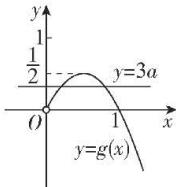

> [!faq]- 答案与解析
>
> > [!success]- **【答案】** B
>
> > [!note]- **【解析】**
> > B【解析】由 $f(x) = x^{2} - 2x + 3a\ln x$ ，令 $f^{\prime}(x) = 2x - 2 + \frac{3a}{x} = 0(x > 0)\Rightarrow 3a =$ $-2x^{2} + 2x = -2\left(x - \frac{1}{2}\right)^{2} + \frac{1}{2},$ 当 $0 <   x <   \frac{1}{2}$ 时，函数 $g(x) = -2$ · $\left(x - \frac{1}{2}\right)^{2} + \frac{1}{2}$ 单调递增，当 $x > \frac{1}{2}$ 时，函数 $g(x)$ 单调递减，所以当 $x = \frac{1}{2}$ 时，函数 $g(x) = -2$ $\left(x-\frac{1}{2}\right)^{2}+\frac{1}{2}$ 有最大值 $\frac{1}{2}$ ，且 $g(0)=g(1)=0$ ，
> > 所以当 x>0 时， $f(x)=x^{2}-2x+3a\ln x$ 有两个不同的极值点，
> > 等价于直线 y=3a 与函数 $g(x)=-2\cdot\left(x-\frac{1}{2}\right)^{2}+\frac{1}{2}$ 的图象有两个不同的交点，作出 $y=g(x)$ 在 $(0,+\infty)$ 上的大致图象如图，
> >
> > 
