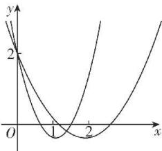
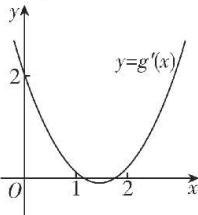

> [!faq]- 答案与解析
>
> > [!success]- **【答案】** A
>
> > [!note]- **【原始答案】** $(2\sqrt{2},3)$
>
> > [!note]- **【解析】**
> > 由 $g(x)=\frac{1}{3}x^{3}-\frac{a}{2}x^{2}+2x+1$ , 得 $g'(x)=x^{2}-ax+2$ .
> >
> > 因为 $g(x)$ 在(1,2)内不单调, 所以 $g'(x)=0$ 在(1,2)内有实数根且无重根.
> >
> > → 点悟: 函数不单调意味着导函数有正有负, 当导函数连续时, 导函数正负交替意味着有变号零点
> >
> > 若 $g'(x)=0$ 在(1,2)内有且只有一个实数根, 则 $g'(x)$ 的图象如图①所示, 则 $g'(1)g'(2)=(1^{2}-a\times1+2)(2^{2}-a\times2+2)<0$ , 即 $2(3-a)^{2}<0$ , 显然不等式无解;
> >
> > 
> > 图①
> >
> > 若 $g^{\prime}(x) = 0$ 在(1,2)内有两个不相等的实数根，则 $g^{\prime}(x)$ 的图象如图②所示，
> > 则 $\left\{ \begin{array}{l} g^{\prime}\left(\frac{a}{2}\right) < 0, \\ g^{\prime}(2) > 0, \\ g^{\prime}(1) > 0, \\ 1 < \frac{a}{2} < 2, \end{array} \right.$ 即 $\left\{ \begin{array}{l} \left(\frac{a}{2}\right)^2 - a \times \frac{a}{2} + 2 < 0, \\ 3 - a > 0, \\ 2 < a < 4, \end{array} \right.$ 解得 $2\sqrt{2} < a < 3.$ 综上，实数 $a$ 的取值范围是 $(2\sqrt{2},3)$ .
> >
> > 
> > 图②
