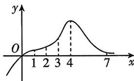

<!-- question-source:start -->
3.[河南洛阳2025高二期中]函数 $f(x)$ 的图象如图所示,则函数 $f(x)$ 在下列区间上平均变化率最大的是()

A. [1,2] B. [2,3] C. [3,4] D. [4,7]

## 题型 2 用定义求函数在某点处的导数(瞬时变化率)
<!-- question-source:end -->

![[Q00070314A1]]
