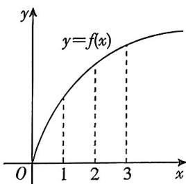

<!-- question-source:start -->
4. (多选)[四川成都树德中学 2025 高二月考]已知函数 $f(x)$ 的部分图象如图所示, $f'(x)$ 是 $f(x)$ 的导函数, 则下列结论正确的是 ( )

A. $f(3) - f(2) > f(2) - f(1)$ B. $f^{\prime}(3) <   f^{\prime}(2)$ C. $f(3) - f(2) > f^{\prime}(3)$ D. $f(3) - f(2) > f^{\prime}(2)$
<!-- question-source:end -->

![[Q00070323A1]]
