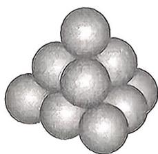

<!-- question-source:start -->
5.[四川绵阳南山中学实验学校2025高二月考]南宋数学家杨辉所著《详解九章算法·商功》中,有如图形状,后人称为“三角垛”.“三角垛”的最上层有1个球,第二层有3个,第三层有6个,…,设各层球数构成一个数列 $\{a_{n}\}$ ,且满足 $a_{n+1}-a_{n}=f(n)$ ,则 $a_{1}+\frac{a_{2}}{2}+\frac{a_{3}}{3}+\cdots+\frac{a_{10}}{10}=$ ( )

A. $\frac{65}{2}$ B. 65 C. 67 D. $\frac{67}{2}$
<!-- question-source:end -->

![[Q00070097A1]]
